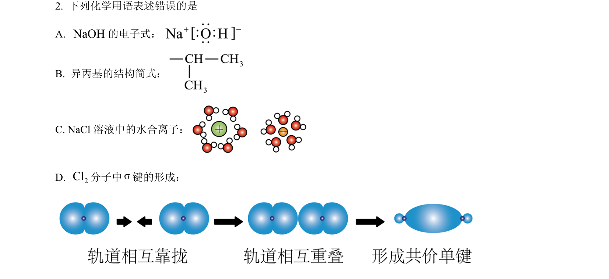
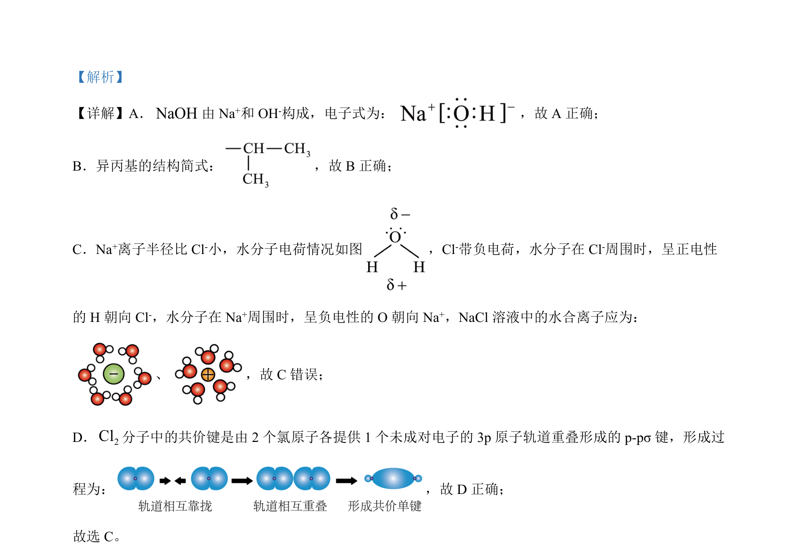

## 题面

## 摘要

该题考查常见化学用语正误判断及实验事故处理方法的选择。

## 关联考点

- [[266-电子式|电子式]]
- [[817-结构简式|结构简式]]
- [[水合离子]]
- [[424-σ键|σ键]]
- [[实验安全]]

## 答案与解析

> 📄 原 PDF 第 1 页：`素材/真题/湖南/2008-2024·（湖南）化学高考真题/2024年高考化学试卷（湖南）（解析卷）.pdf`
