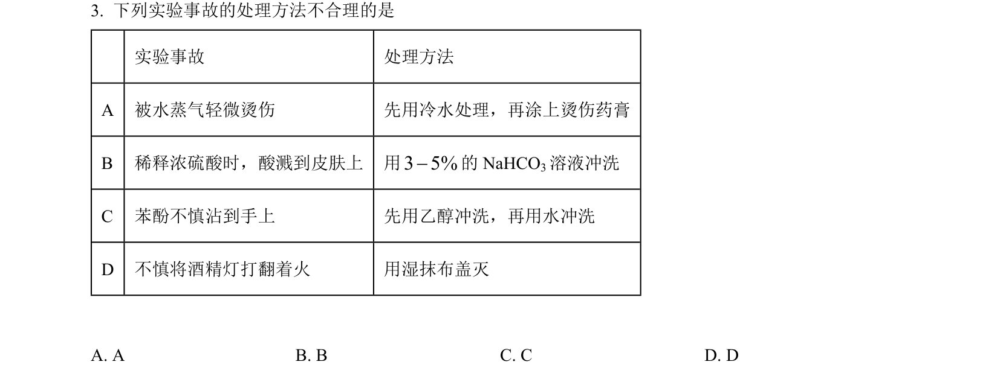
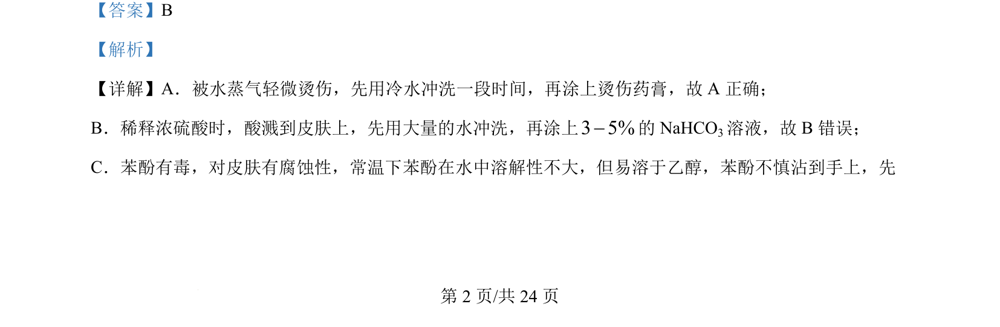
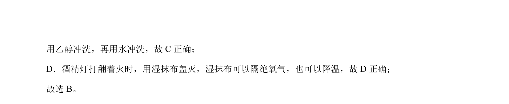

## 题面

## 摘要

实验室安全操作正误判断，涉及烫伤、浓硫酸、苯酚、酒精灯着火等处理。

## 关联考点

- [[611-化学实验安全|化学实验安全]]
- [[140-浓硫酸稀释|浓硫酸稀释]]
- [[苯酚性质]]
- [[酒精灯使用]]

## 答案与解析

> 📄 原 PDF 第 2 页：`素材/真题/湖南/2008-2024·（湖南）化学高考真题/2024年高考化学试卷（湖南）（解析卷）.pdf`
