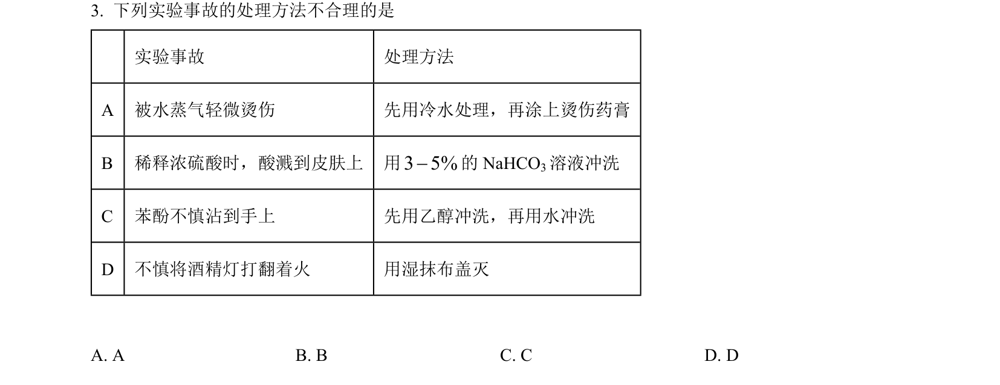
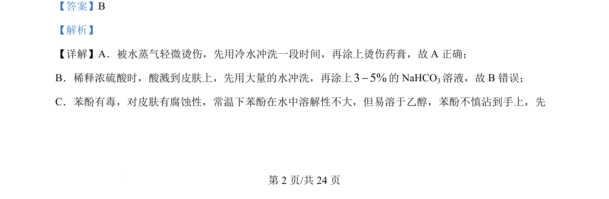
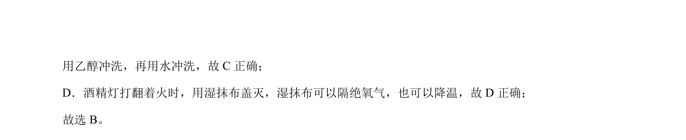

## 题面

## 摘要

实验室安全操作正误判断，涉及烫伤、浓硫酸、苯酚、酒精灯着火等处理。

## 关联考点

- [[611-化学实验安全|化学实验安全]]
- [[140-浓硫酸稀释|浓硫酸稀释]]
- [[苯酚性质]]
- [[酒精灯使用]]

## 答案与解析

> 📄 原 PDF 第 2 页：`素材/真题/湖南/2008-2024·（湖南）化学高考真题/2024年高考化学试卷（湖南）（解析卷）.pdf`

<!-- 题干文本-start -->
## 题干文本
3. 下列实验事故的处理方法不合理的是
实验事故 处理方法
A 被水蒸气轻微烫伤 先用冷水处理，再涂上烫伤药膏
B 稀释浓硫酸时，酸溅到皮肤上 用3 5%-的 NaHCO3溶液冲洗
C 苯酚不慎沾到手上 先用乙醇冲洗，再用水冲洗
D 不慎将酒精灯打翻着火 用湿抹布盖灭
A. A B. B C. C D. D
<!-- 题干文本-end -->

<!-- 解析文本-start -->
## 解析文本
【答案】B
【解析】
【详解】A．被水蒸气轻微烫伤，先用冷水冲洗一段时间，再涂上烫伤药膏，故 A 正确；
B．稀释浓硫酸时，酸溅到皮肤上，先用大量的水冲洗，再涂上3 5%-的 NaHCO3溶液，故 B错误；
C．苯酚有毒，对皮肤有腐蚀性，常温下苯酚在水中溶解性不大，但易溶于乙醇，苯酚不慎沾到手上，先
<!-- 解析文本-end -->
