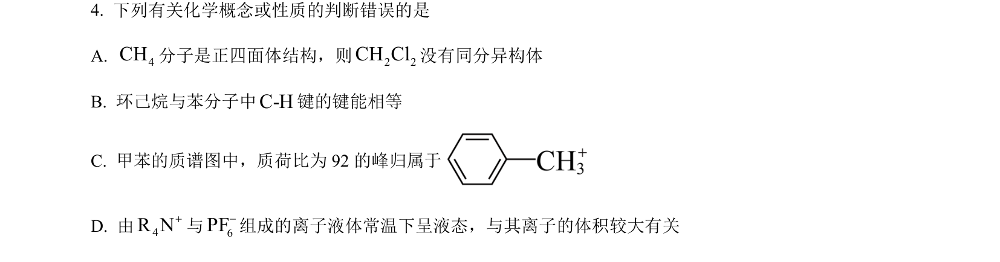
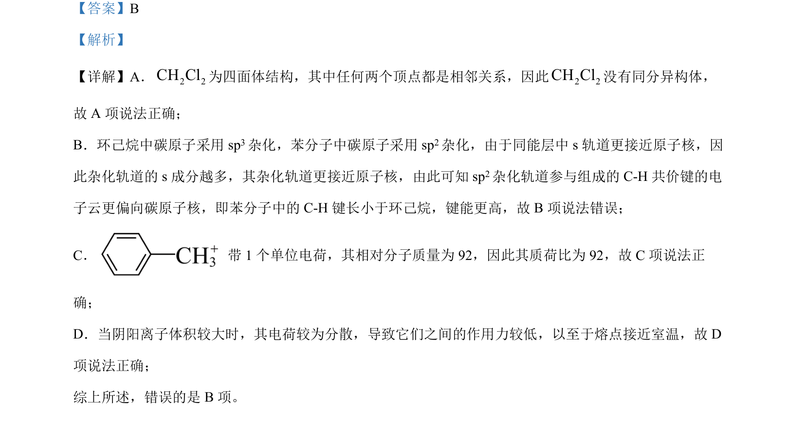

## 题面

## 摘要

该题考查分子结构、杂化轨道、质谱分析及离子化合物性质等基本概念。

## 关联考点

- [[446-同分异构体|同分异构体]]
- [[720-杂化轨道|杂化轨道]]
- [[键能与键长]]
- [[质谱分析]]

## 答案与解析

> 📄 原 PDF 第 3 页：`素材/真题/湖南/2008-2024·（湖南）化学高考真题/2024年高考化学试卷（湖南）（解析卷）.pdf`
