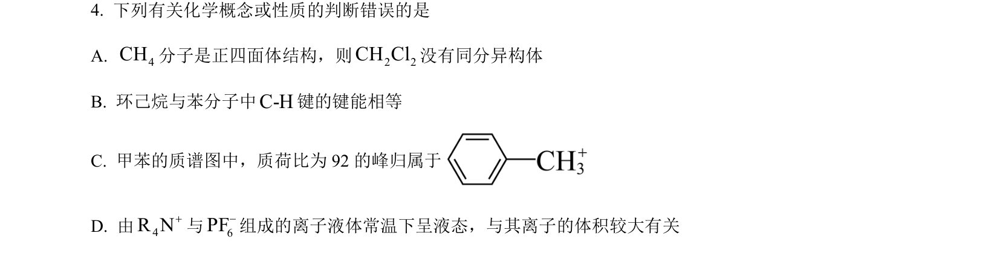
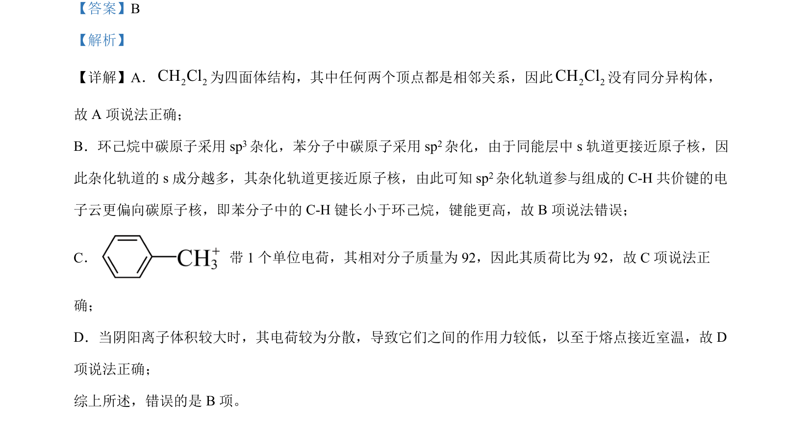

## 题面

## 摘要

该题考查分子结构、杂化轨道、质谱分析及离子化合物性质等基本概念。

## 关联考点

- [[446-同分异构体|同分异构体]]
- [[720-杂化轨道|杂化轨道]]
- [[键能与键长]]
- [[质谱分析]]

## 答案与解析

> 📄 原 PDF 第 3 页：`素材/真题/湖南/2008-2024·（湖南）化学高考真题/2024年高考化学试卷（湖南）（解析卷）.pdf`

<!-- 题干文本-start -->
## 题干文本
4. 下列有关化学概念或性质的判断错误的是
A. 4CH分子是正四面体结构，则2 2CH Cl没有同分异构体
B. 环己烷与苯分子中C-H键的键能相等
C. 甲苯的质谱图中，质荷比为 92 的峰归属于
D. 由4R N+与6PF-组成的离子液体常温下呈液态，与其离子的体积较大有关
<!-- 题干文本-end -->

<!-- 解析文本-start -->
## 解析文本
【答案】B
【解析】
【详解】A．2 2CH Cl为四面体结构，其中任何两个顶点都是相邻关系，因此2 2CH Cl没有同分异构体，
故 A 项说法正确；
B．环己烷中碳原子采用 sp3杂化，苯分子中碳原子采用 sp2杂化，由于同能层中 s 轨道更接近原子核，因
此杂化轨道的 s 成分越多，其杂化轨道更接近原子核，由此可知 sp2杂化轨道参与组成的 C-H 共价键的电
子云更偏向碳原子核，即苯分子中的 C-H 键长小于环己烷，键能更高，故 B项说法错误；
C． 带 1 个单位电荷，其相对分子质量为 92，因此其质荷比为 92，故 C项说法正
确；
D．当阴阳离子体积较大时，其电荷较为分散，导致它们之间的作用力较低，以至于熔点接近室温，故 D
项说法正确；
综上所述，错误的是 B项。
<!-- 解析文本-end -->
