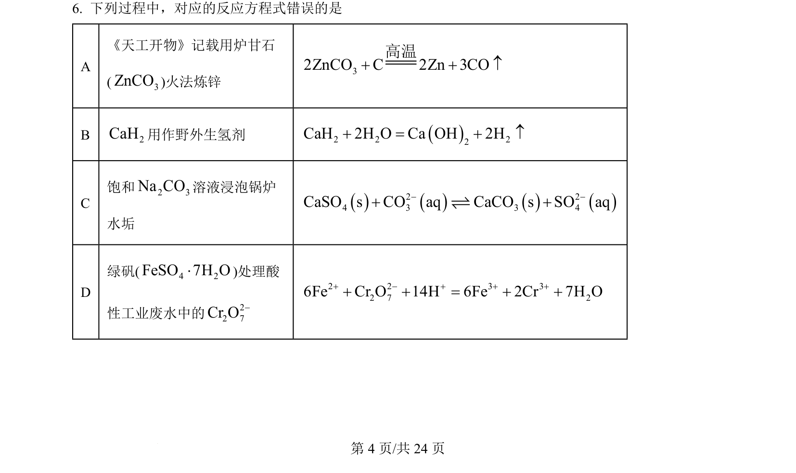
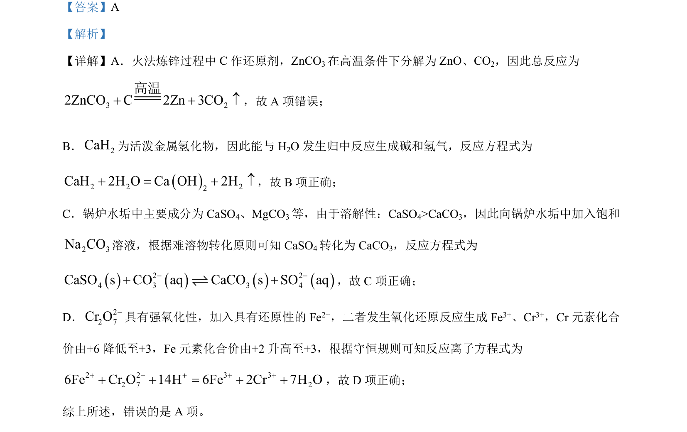

## 题面

## 摘要

化学方程式正误判断，涉及火法炼锌、活泼金属氢化物与水反应及沉淀转化

## 关联考点

- [[化学方程式正误判断]]
- [[162-氧化还原反应|氧化还原反应]]
- [[330-沉淀转化|沉淀转化]]

## 答案与解析

> 📄 原 PDF 第 4 页：`素材/真题/湖南/2008-2024·（湖南）化学高考真题/2024年高考化学试卷（湖南）（解析卷）.pdf`
