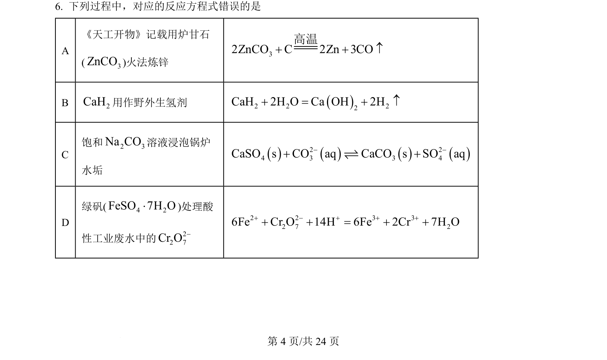
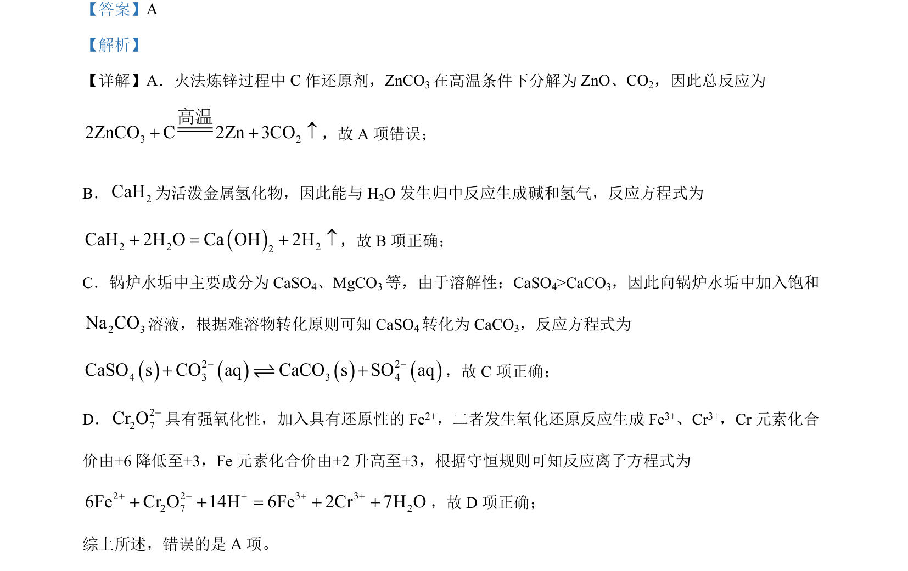

## 题面

## 摘要

化学方程式正误判断，涉及火法炼锌、活泼金属氢化物与水反应及沉淀转化

## 关联考点

- [[化学方程式正误判断]]
- [[162-氧化还原反应|氧化还原反应]]
- [[330-沉淀转化|沉淀转化]]

## 答案与解析

> 📄 原 PDF 第 4 页：`素材/真题/湖南/2008-2024·（湖南）化学高考真题/2024年高考化学试卷（湖南）（解析卷）.pdf`

<!-- 题干文本-start -->
## 题干文本
6. 下列过程中，对应的反应方程式错误的是
A
《天工开物》记载用炉甘石
( 3ZnCO)火法炼锌
32ZnCO C 2Zn 3CO+ + ­高温
B 2CaH用作野外生氢剂 ()2 2 22CaH 2H O Ca OH 2H+ = + ­
C
饱和2 3Na CO溶液浸泡锅炉
水垢
()()()()2 24 3 3 4CaSO s CO aq CaCO s SO aq- -+ +ƒ
D
绿矾( 4 2FeSO 7H O×)处理酸
性工业废水中的22 7Cr O-2 2 3 32 7 26Fe Cr O 14H 6Fe 2Cr 7H O+ - + + ++ + = + +
<!-- 题干文本-end -->

<!-- 解析文本-start -->
## 解析文本

<!-- 解析文本-end -->
