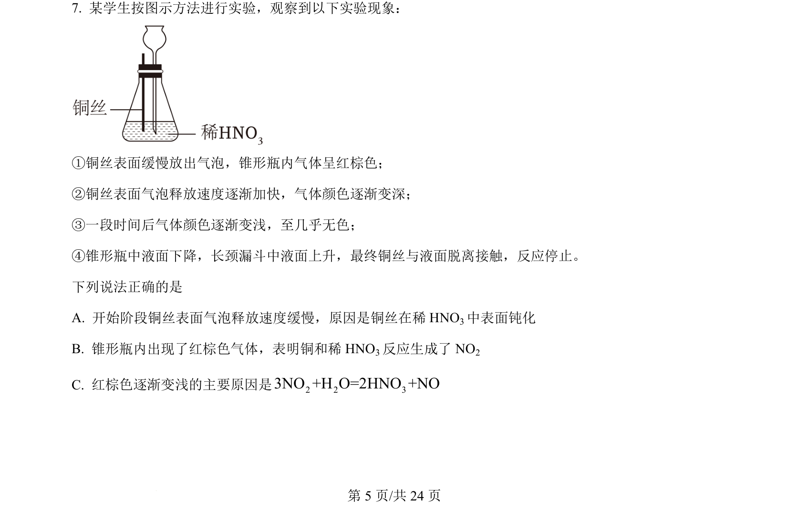
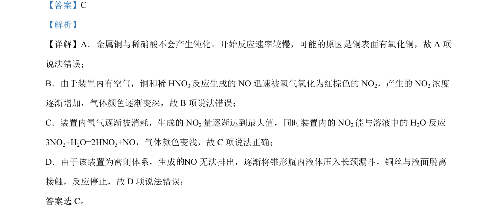

## 题面

## 摘要

考查铜与稀硝酸反应的现象分析及氮氧化物转化。

## 关联考点

- [[铜与稀硝酸反应]]
- [[一氧化氮与氧气反应]]
- [[二氧化氮与水的反应]]

## 答案与解析

> 📄 原 PDF 第 5 页：`素材/真题/湖南/2008-2024·（湖南）化学高考真题/2024年高考化学试卷（湖南）（解析卷）.pdf`

<!-- 题干文本-start -->
## 题干文本
7. 某学生按图示方法进行实验，观察到以下实验现象：
①铜丝表面缓慢放出气泡，锥形瓶内气体呈红棕色；
②铜丝表面气泡释放速度逐渐加快，气体颜色逐渐变深；
③一段时间后气体颜色逐渐变浅，至几乎无色；
④锥形瓶中液面下降，长颈漏斗中液面上升，最终铜丝与液面脱离接触，反应停止。
下列说法正确的是
A. 开始阶段铜丝表面气泡释放速度缓慢，原因是铜丝在稀 HNO3中表面钝化
B. 锥形瓶内出现了红棕色气体，表明铜和稀 HNO3反应生成了 NO2
C. 红棕色逐渐变浅的主要原因是2 2 33NO +H O=2HNO +NO
<!-- 题干文本-end -->

<!-- 解析文本-start -->
## 解析文本

<!-- 解析文本-end -->
