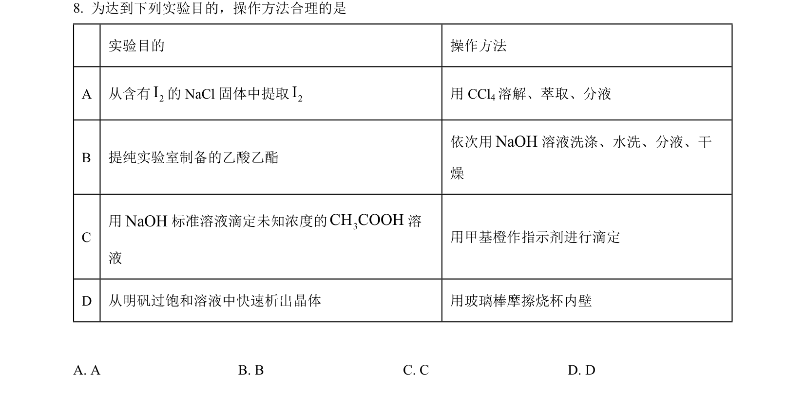
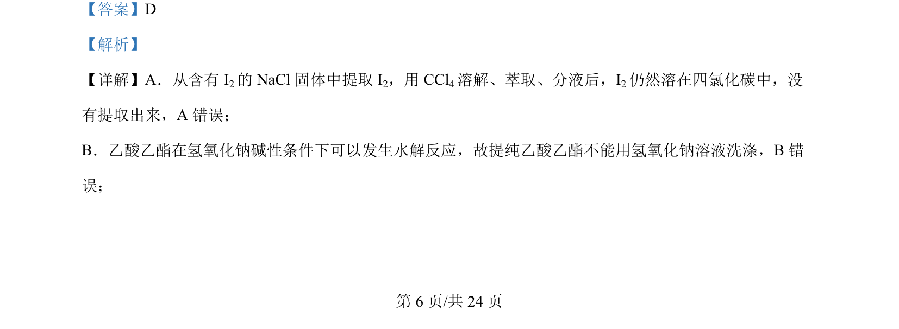
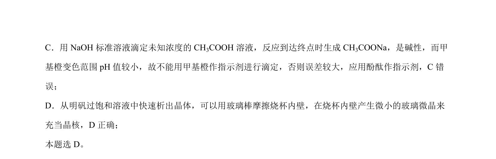

## 题面

## 摘要

考查萃取、酯的水解、酸碱滴定指示剂选择及晶体制备等实验基本操作。

## 关联考点

- [[832-萃取|萃取]]
- [[850-酯基降解|酯的水解]]
- [[酸碱中和滴定指示剂]]
- [[晶体制备]]

## 答案与解析

> 📄 原 PDF 第 6 页：`素材/真题/湖南/2008-2024·（湖南）化学高考真题/2024年高考化学试卷（湖南）（解析卷）.pdf`
