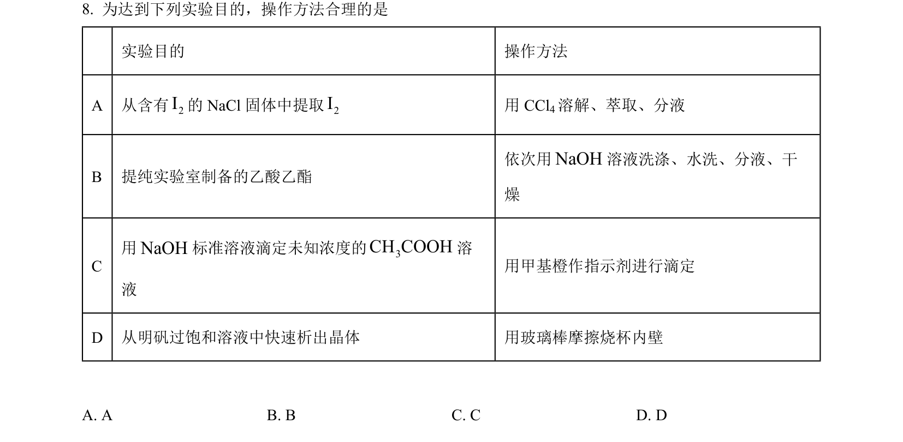
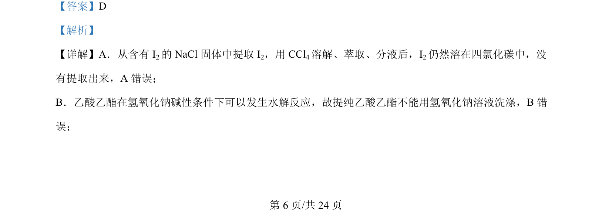
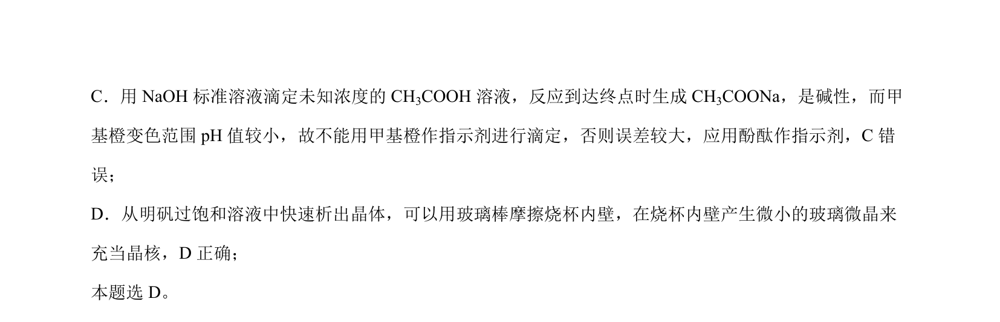

## 题面

## 摘要

考查萃取、酯的水解、酸碱滴定指示剂选择及晶体制备等实验基本操作。

## 关联考点

- [[832-萃取|萃取]]
- [[850-酯基降解|酯的水解]]
- [[酸碱中和滴定指示剂]]
- [[晶体制备]]

## 答案与解析

> 📄 原 PDF 第 6 页：`素材/真题/湖南/2008-2024·（湖南）化学高考真题/2024年高考化学试卷（湖南）（解析卷）.pdf`

<!-- 题干文本-start -->
## 题干文本
8. 为达到下列实验目的，操作方法合理的是
实验目的 操作方法
A 从含有2I的 NaCl固体中提取2I用 CCl4溶解、萃取、分液
B 提纯实验室制备的乙酸乙酯
依次用NaOH溶液洗涤、水洗、分液、干
燥
C
用NaOH标准溶液滴定未知浓度的3CH COOH溶
液
用甲基橙作指示剂进行滴定
D 从明矾过饱和溶液中快速析出晶体 用玻璃棒摩擦烧杯内壁
A. A B. B C. C D. D
<!-- 题干文本-end -->

<!-- 解析文本-start -->
## 解析文本
【答案】D
【解析】
【详解】A．从含有 I2的 NaCl固体中提取 I2，用 CCl4溶解、萃取、分液后，I2仍然溶在四氯化碳中，没
有提取出来，A 错误；
B．乙酸乙酯在氢氧化钠碱性条件下可以发生水解反应，故提纯乙酸乙酯不能用氢氧化钠溶液洗涤，B错
误；
的
<!-- 解析文本-end -->
