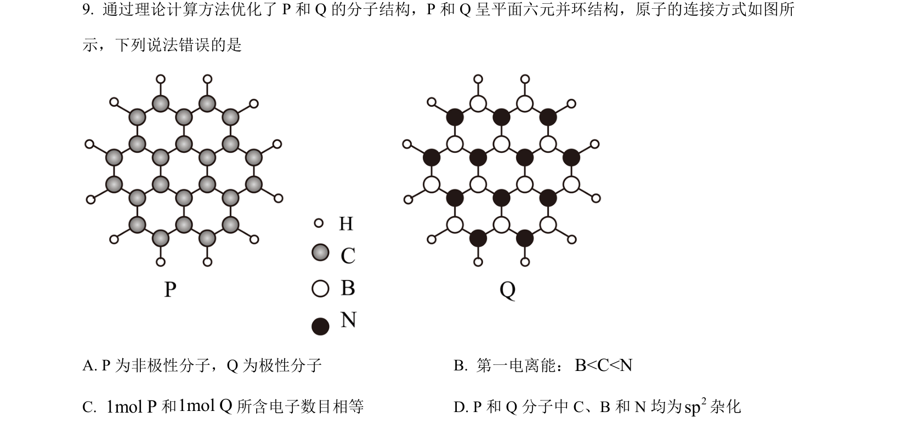
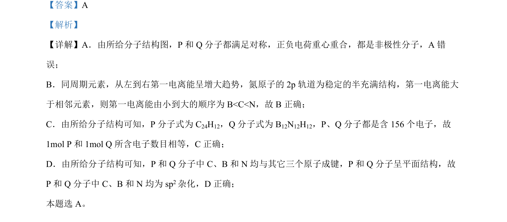

## 题面

## 摘要

该题考查分子极性判断、第一电离能比较、电子数计算和杂化方式分析。

## 关联考点

- [[极性分子与非极性分子]]
- [[393-第一电离能|第一电离能]]
- [[1002-等电子体|等电子体]]
- [[420-sp2杂化|sp2杂化]]

## 答案与解析

> 📄 原 PDF 第 7 页：`素材/真题/湖南/2008-2024·（湖南）化学高考真题/2024年高考化学试卷（湖南）（解析卷）.pdf`
