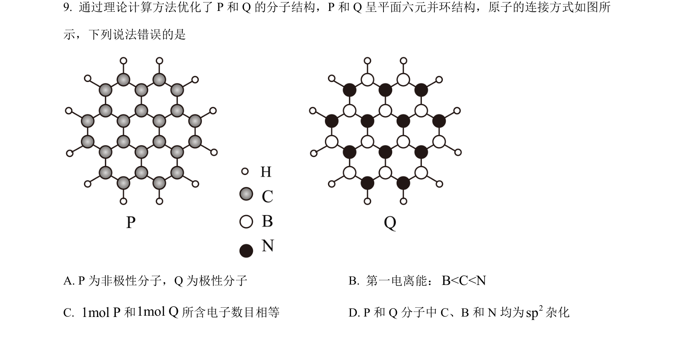
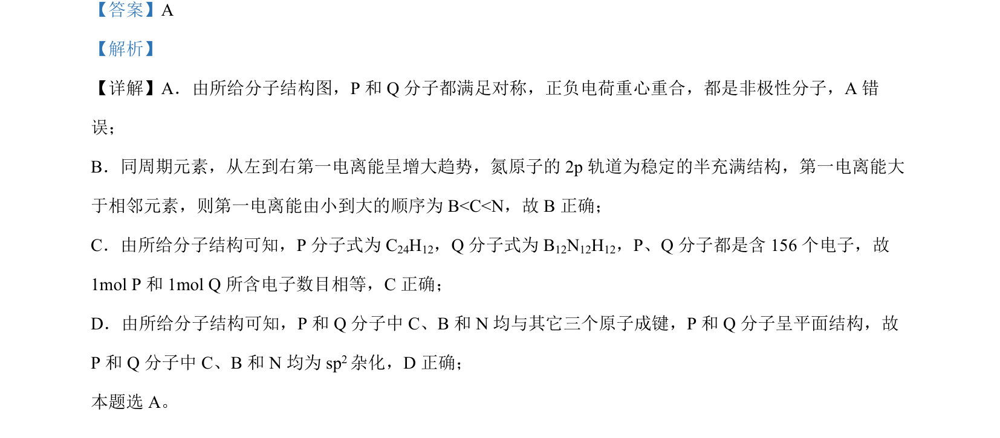

## 题面

## 摘要

该题考查分子极性判断、第一电离能比较、电子数计算和杂化方式分析。

## 关联考点

- [[极性分子与非极性分子]]
- [[393-第一电离能|第一电离能]]
- [[1002-等电子体|等电子体]]
- [[420-sp2杂化|sp2杂化]]

## 答案与解析

> 📄 原 PDF 第 7 页：`素材/真题/湖南/2008-2024·（湖南）化学高考真题/2024年高考化学试卷（湖南）（解析卷）.pdf`

<!-- 题干文本-start -->
## 题干文本
9. 通过理论计算方法优化了 P 和 Q 的分子结构，P 和 Q 呈平面六元并环结构，原子的连接方式如图所
示，下列说法错误的是
A. P 为非极性分子，Q 为极性分子 B. 第一电离能：B<C<N
C. 1mol P和1mol Q所含电子数目相等 D. P 和 Q 分子中 C、B和 N 均为2sp杂化
<!-- 题干文本-end -->

<!-- 解析文本-start -->
## 解析文本
【答案】A
【解析】
【详解】A．由所给分子结构图，P 和 Q 分子都满足对称，正负电荷重心重合，都是非极性分子，A 错
误；
B．同周期元素，从左到右第一电离能呈增大趋势，氮原子的 2p 轨道为稳定的半充满结构，第一电离能大
于相邻元素，则第一电离能由小到大的顺序为 B<C<N，故 B正确；
C．由所给分子结构可知，P 分子式为 C24H12，Q 分子式为 B12N12H12，P、Q 分子都是含 156 个电子，故
1mol P和 1mol Q所含电子数目相等，C正确；
D．由所给分子结构可知，P 和 Q 分子中 C、B和 N 均与其它三个原子成键，P 和 Q 分子呈平面结构，故
P 和 Q 分子中 C、B和 N 均为 sp2杂化，D 正确；
本题选 A。
<!-- 解析文本-end -->
