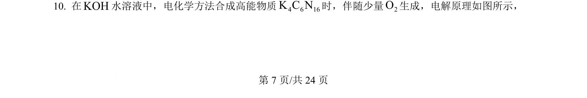
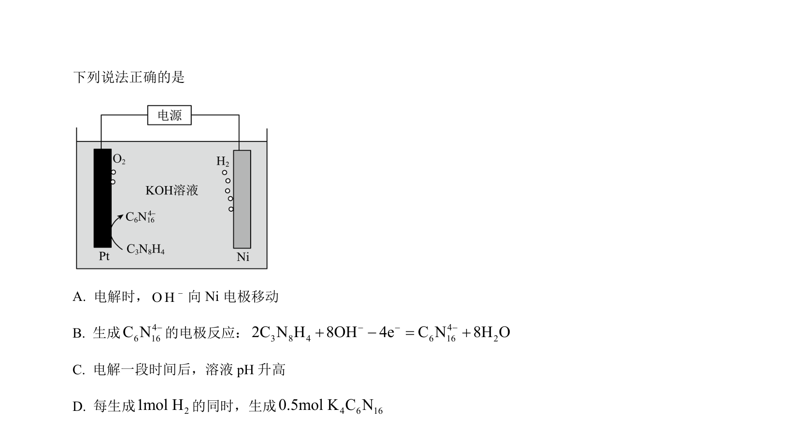
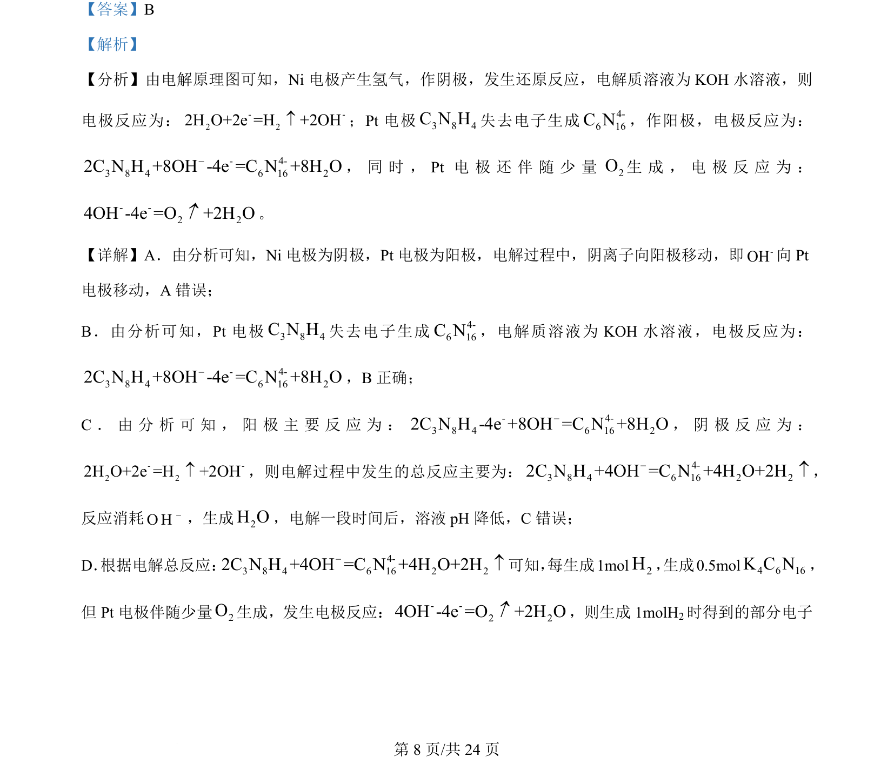
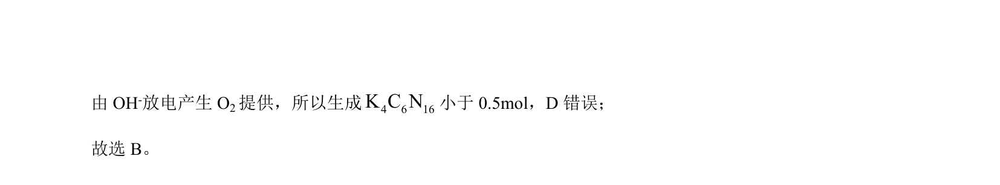

## 题面

## 摘要

考查电解池工作原理，涉及电极判断、电极反应书写及离子移动方向

## 关联考点

- [[368-电解池|电解池]]
- [[794-电极反应式|电极反应式]]
- [[阳极]]
- [[阴极]]
- [[离子移动]]

## 答案与解析

> 📄 原 PDF 第 7 页：`素材/真题/湖南/2008-2024·（湖南）化学高考真题/2024年高考化学试卷（湖南）（解析卷）.pdf`
