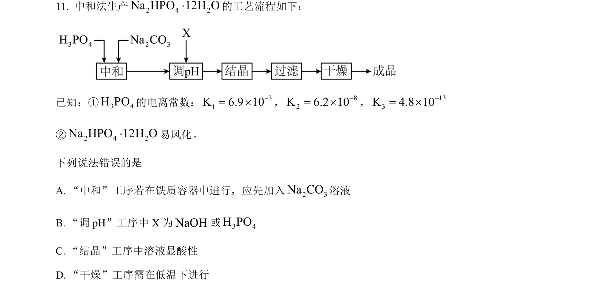
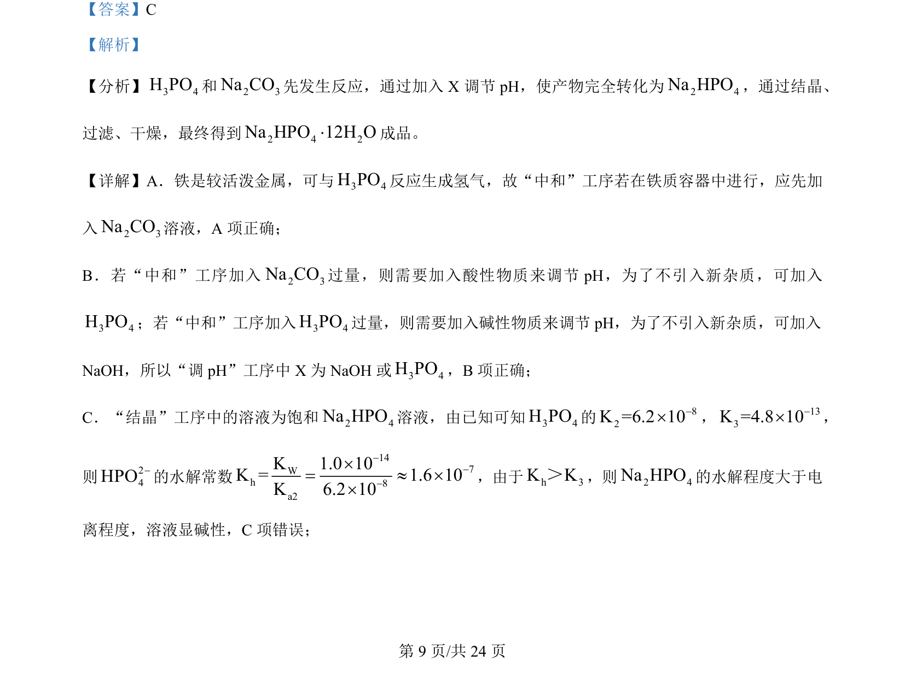
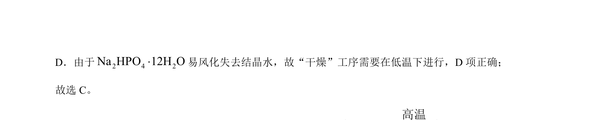

## 题面

## 摘要

考查磷酸与碳酸钠中和制备磷酸氢二钠，涉及加料顺序、pH调节与除杂分析

## 关联考点

- [[制备实验工艺流程]]
- [[pH调节与除杂]]
- [[物质转化]]

## 答案与解析

> 📄 原 PDF 第 9 页：`素材/真题/湖南/2008-2024·（湖南）化学高考真题/2024年高考化学试卷（湖南）（解析卷）.pdf`

<!-- 题干文本-start -->
## 题干文本
11. 中和法生产2 4 2Na HPO 12H O×的工艺流程如下：
已知：①3 4H PO的电离常数： 31K 6.9 10-= ´， 82K 6.2 10-= ´， 133K 4.8 10-= ´
②2 4 2Na HPO 12H O×易风化。
下列说法错误的是
A. “中和”工序若在铁质容器中进行，应先加入2 3Na CO溶液
B. “调 pH”工序中 X 为NaOH或3 4H PO
C. “结晶”工序中溶液显酸性
D. “干燥”工序需在低温下进行
<!-- 题干文本-end -->

<!-- 解析文本-start -->
## 解析文本
【答案】C
【解析】
【分析】3 4H PO和2 3Na CO先发生反应，通过加入 X 调节 pH，使产物完全转化为2 4Na HPO，通过结晶、
过滤、干燥，最终得到2 4 2Na HPO 12H O×成品。
【详解】A．铁是较活泼金属，可与3 4H PO反应生成氢气，故“中和”工序若在铁质容器中进行，应先加
入2 3Na CO溶液，A 项正确；
B．若“中和”工序加入2 3Na CO过量，则需要加入酸性物质来调节 pH，为了不引入新杂质，可加入
3 4H PO；若“中和”工序加入3 4H PO过量，则需要加入碱性物质来调节 pH，为了不引入新杂质，可加入
NaOH，所以“调 pH”工序中 X 为 NaOH 或3 4H PO，B项正确；
C．“结晶”工序中的溶液为饱和2 4Na HPO溶液，由已知可知3 4H PO的 82K =6.2 10-´， 133K =4.8 10-´，
则24HPO-的水解常数
147Wh8a2K1.0 10K = 1.6 10K 6.2 10---´= » ´´
，由于h 3K K＞，则2 4Na HPO的水解程度大于电
离程度，溶液显碱性，C项错误；
<!-- 解析文本-end -->
