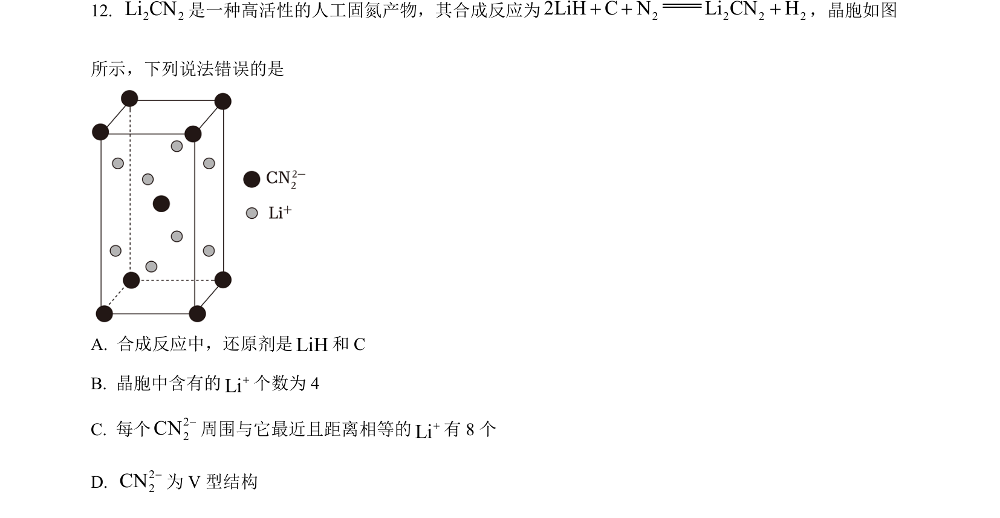
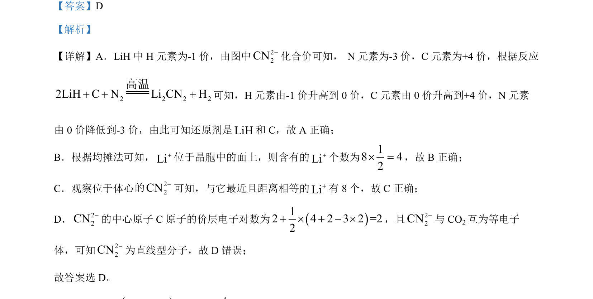

## 题面

## 摘要

该题考查LiH与C、N₂反应中氧化还原判断、晶胞中Li⁺数目及配位数、CN₂²⁻结构与价层电子对互斥理论。

## 关联考点

- [[162-氧化还原反应|氧化还原反应]]
- [[晶胞均摊法]]
- [[439-配位数|配位数]]
- [[419-VSEPR|价层电子对互斥理论]]
- [[1002-等电子体|等电子体]]

## 答案与解析

> 📄 原 PDF 第 10 页：`素材/真题/湖南/2008-2024·（湖南）化学高考真题/2024年高考化学试卷（湖南）（解析卷）.pdf`
