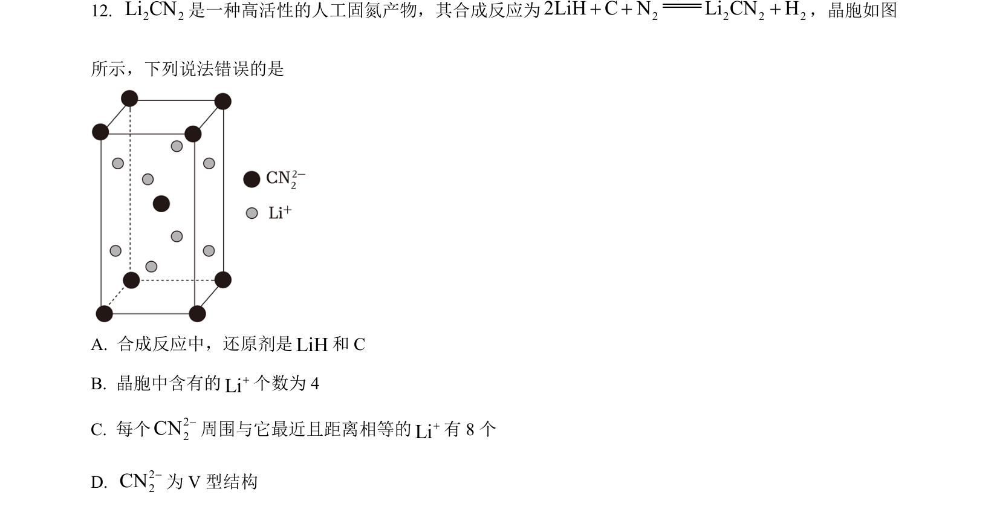
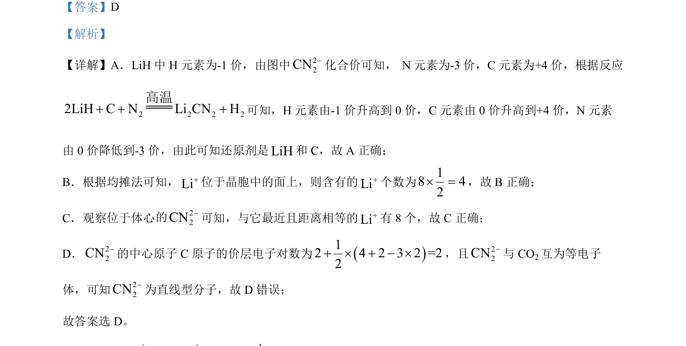

## 题面

## 摘要

该题考查LiH与C、N₂反应中氧化还原判断、晶胞中Li⁺数目及配位数、CN₂²⁻结构与价层电子对互斥理论。

## 关联考点

- [[162-氧化还原反应|氧化还原反应]]
- [[晶胞均摊法]]
- [[439-配位数|配位数]]
- [[419-VSEPR|价层电子对互斥理论]]
- [[1002-等电子体|等电子体]]

## 答案与解析

> 📄 原 PDF 第 10 页：`素材/真题/湖南/2008-2024·（湖南）化学高考真题/2024年高考化学试卷（湖南）（解析卷）.pdf`

<!-- 题干文本-start -->
## 题干文本
12. 2 2Li CN是一种高活性的人工固氮产物，其合成反应为 2 2 2 22LiH C N Li CN H+ + +高温
，晶胞如图
所示，下列说法错误的是
A. 合成反应中，还原剂是LiH和 C
B. 晶胞中含有的Li+个数为 4
C. 每个22CN-周围与它最近且距离相等的Li+有 8 个
D. 22CN-为 V 型结构
<!-- 题干文本-end -->

<!-- 解析文本-start -->
## 解析文本
【答案】D
【解析】
【详解】A．LiH中 H 元素为-1 价，由图中22CN-化合价可知， N 元素为-3 价，C元素为+4价，根据反应
2 2 2 22LiH C N Li CN H+ + +高温
可知，H 元素由-1 价升高到 0 价，C元素由 0 价升高到+4价，N 元素
由 0 价降低到-3 价，由此可知还原剂是LiH和 C，故 A 正确；
B．根据均摊法可知，Li+位于晶胞中的面上，则含有的Li+个数为18 42´ =，故 B正确；
C．观察位于体心 22CN-可知，与它最近且距离相等的Li+有 8 个，故 C正确；
D．22CN-的中心原子 C原子的价层电子对数为12 4 2 3 2 =22+ ´ + - ´，且22CN-与 CO2互为等电子
体，可知22CN-为直线型分子，故 D 错误；
故答案选 D。
<!-- 解析文本-end -->
