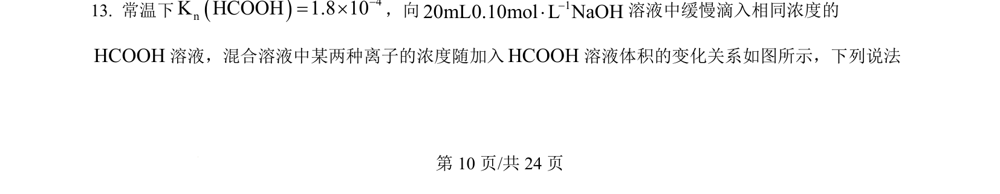
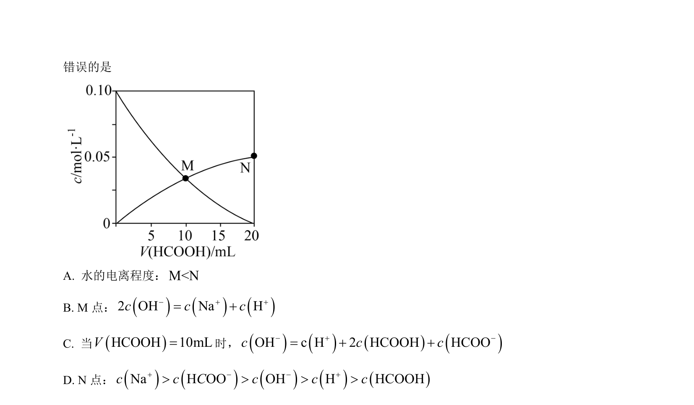
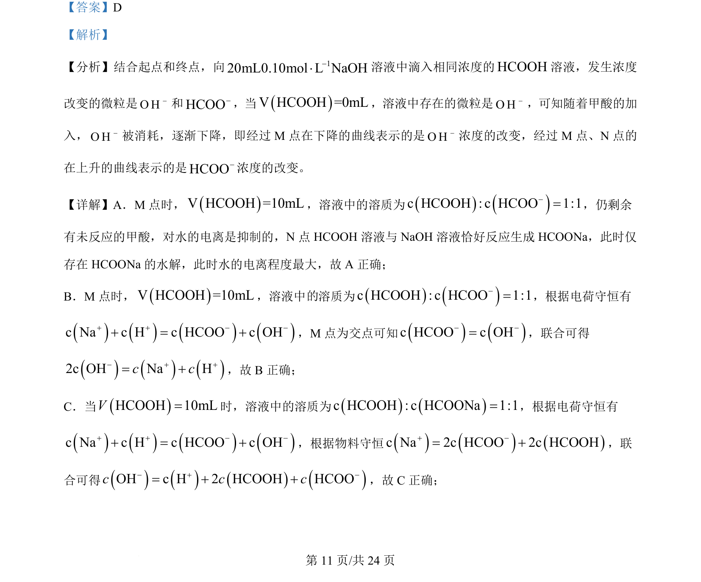
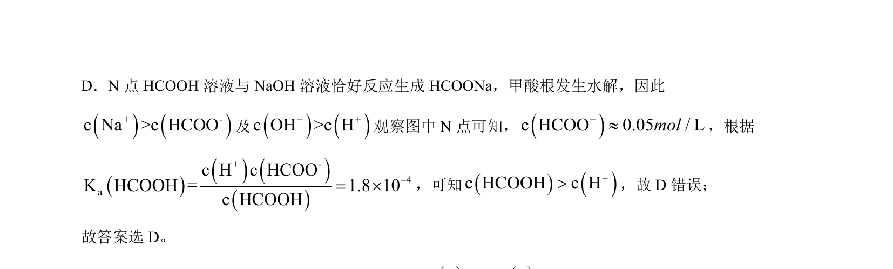

## 题面

## 摘要

向NaOH溶液中滴加甲酸，分析离子浓度变化曲线及水的电离程度、电荷守恒等。

## 关联考点

- [[854-酸碱滴定|酸碱滴定]]
- [[337-离子浓度比较|离子浓度比较]]
- [[689-电荷数守恒|电荷守恒]]
- [[324-水的电离|水的电离]]

## 答案与解析

> 📄 原 PDF 第 10 页：`素材/真题/湖南/2008-2024·（湖南）化学高考真题/2024年高考化学试卷（湖南）（解析卷）.pdf`
