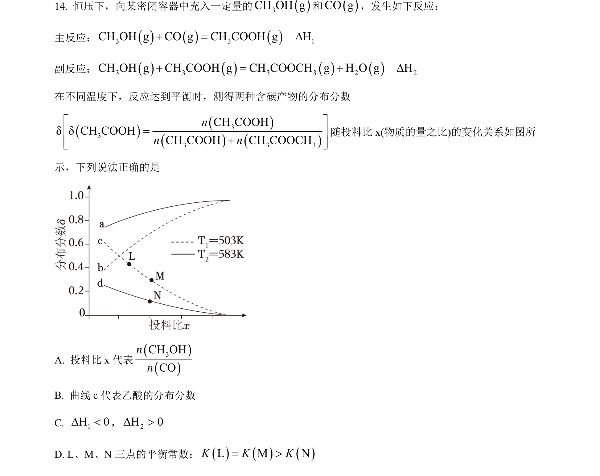
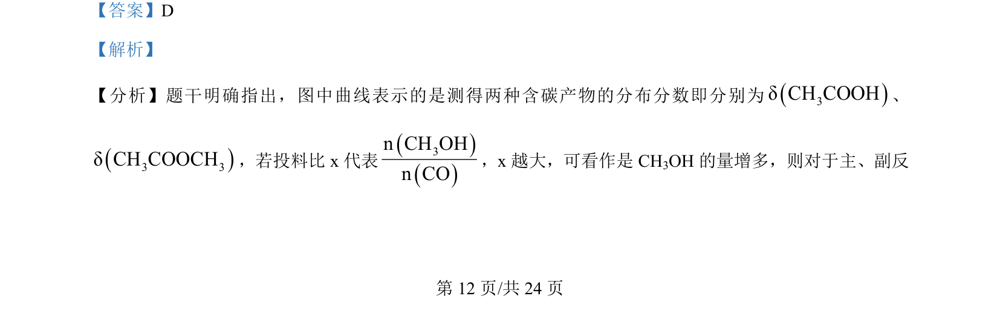
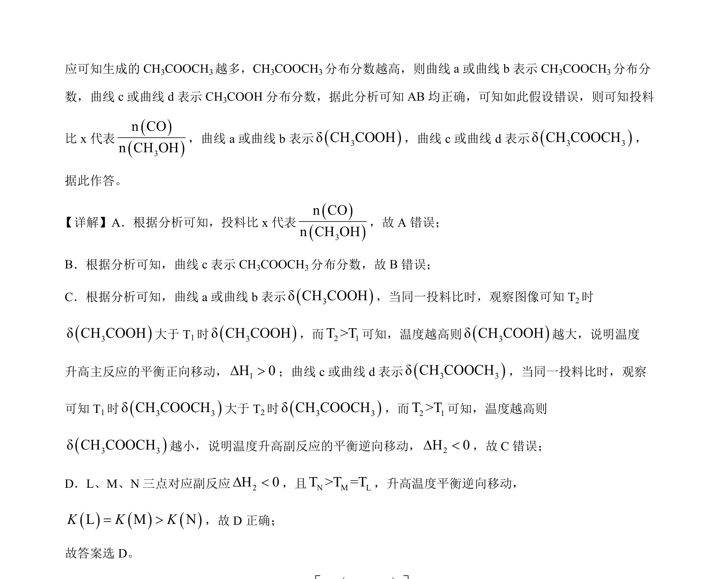

## 题面

## 摘要

通过投料比对含碳产物分布分数曲线的影响，考查反应物配比与主副反应产物的判断。

## 关联考点

- [[分布分数]]
- [[投料比]]
- [[972-副反应|副反应]]

## 答案与解析

> 📄 原 PDF 第 12 页：`素材/真题/湖南/2008-2024·（湖南）化学高考真题/2024年高考化学试卷（湖南）（解析卷）.pdf`

<!-- 题干文本-start -->
## 题干文本
14. 恒压下，向某密闭容器中充入一定量的()3CH OH g和()CO g，发生如下反应：
主反应：()()()3 3CH OH g CO g CH COOH g+ =  1HD
副反应：()()()()3 3 3 3 2CH OH g CH COOH g CH COOCH g H O g+ = +  2HD
在不同温度下，反应达到平衡时，测得两种含碳产物的分布分数
()()()()333 3 3CH COOHδδCH COOHCH COOH CH COOCHnn né ù=ê ú+ê úë û
随投料比 x(物质的量之比)的变化关系如图所
示，下列说法正确的是
A. 投料比 x 代表
()()3CH OHCOnn
B. 曲线 c代表乙酸的分布分数
C. 1H 0D <，2H 0D >
D. L、M、N 三点的平衡常数：()()()L M NK K K= >
<!-- 题干文本-end -->

<!-- 解析文本-start -->
## 解析文本
【答案】D
【解析】
【分析】题干明确指出，图中曲线表示的是测得两种含碳产物的分布分数即分别为()3δCH COOH、
()3 3δCH COOCH，若投料比 x 代表
()()3n CH OHn CO，x 越大，可看作是 CH3OH 的量增多，则对于主、副反
<!-- 解析文本-end -->
