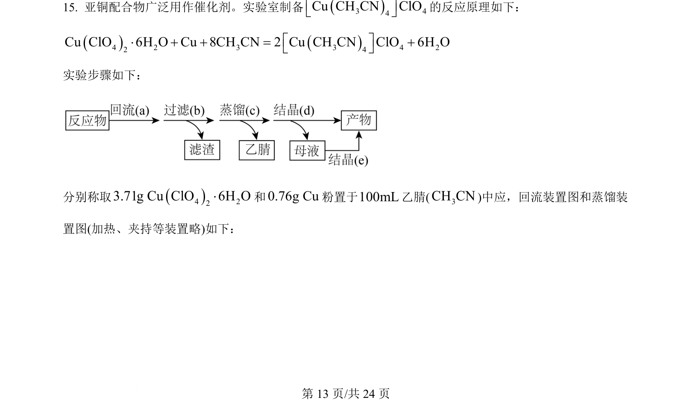
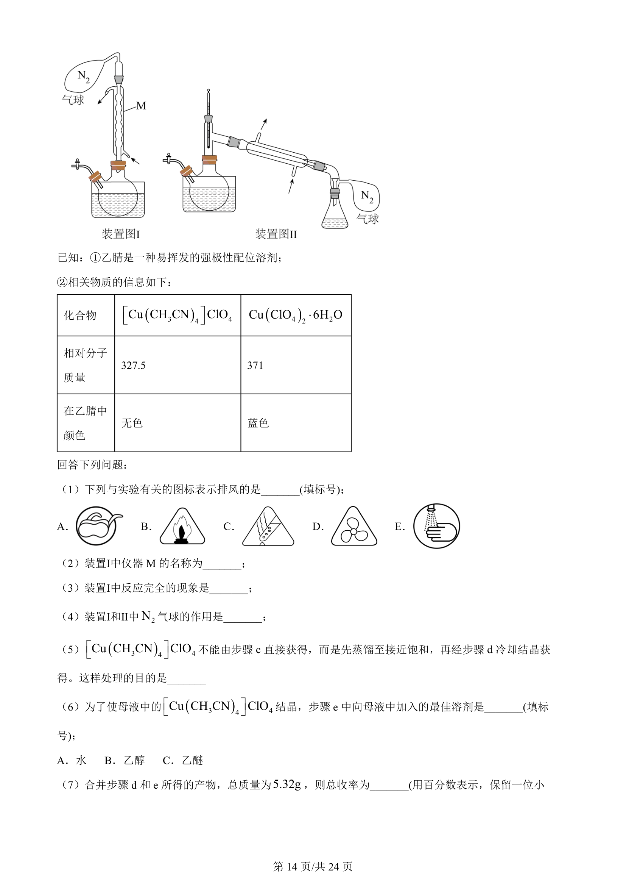
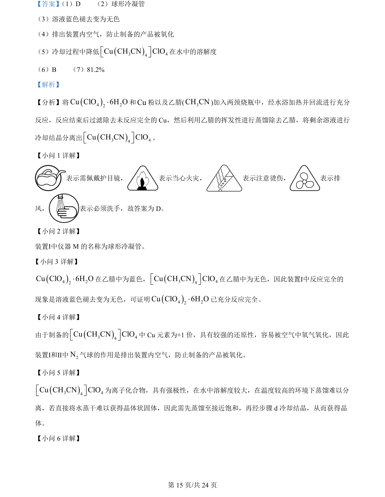
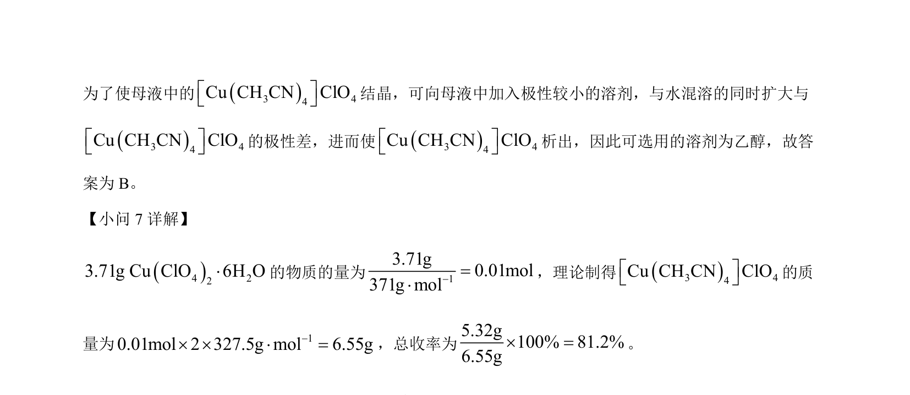

## 题面

## 摘要

以Cu(ClO₄)₂·6H₂O、Cu粉和乙腈为原料制备[Cu(CH₃CN)₄]ClO₄，考查实验装置、操作及原理分析。

## 关联考点

- [[物质的制备与分离]]
- [[实验安全与标识]]
- [[防氧化操作]]
- [[仪器名称与用途]]

## 答案与解析

> 📄 原 PDF 第 13 页：`素材/真题/湖南/2008-2024·（湖南）化学高考真题/2024年高考化学试卷（湖南）（解析卷）.pdf`
