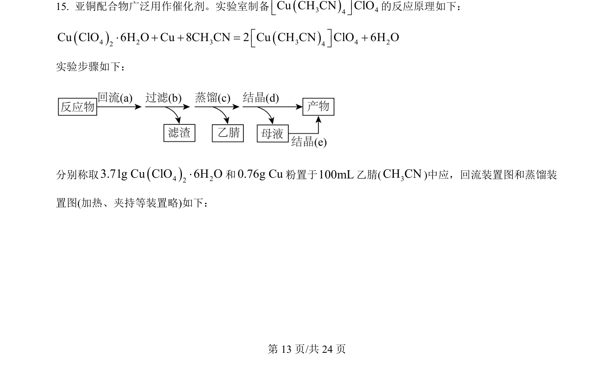
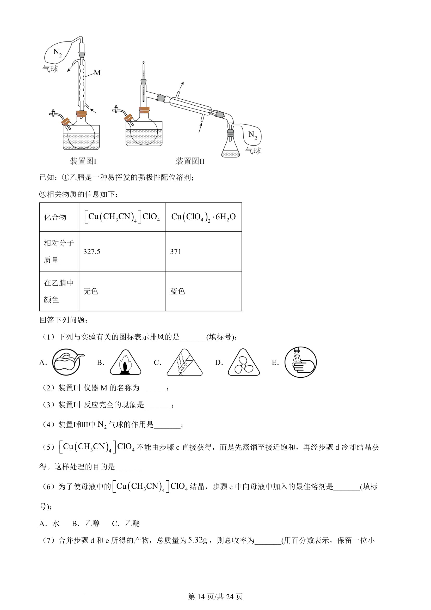
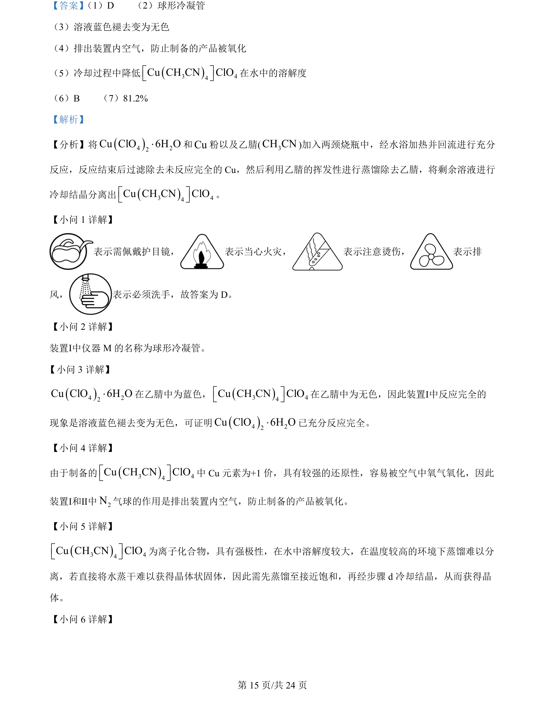
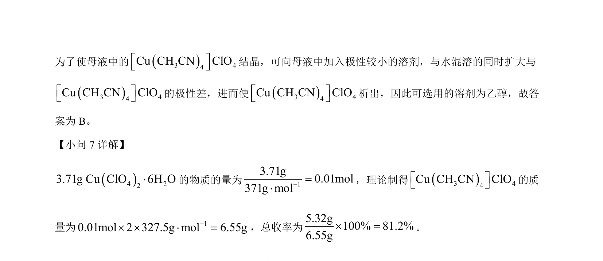

## 题面

## 摘要

以Cu(ClO₄)₂·6H₂O、Cu粉和乙腈为原料制备[Cu(CH₃CN)₄]ClO₄，考查实验装置、操作及原理分析。

## 关联考点

- [[物质的制备与分离]]
- [[实验安全与标识]]
- [[防氧化操作]]
- [[仪器名称与用途]]

## 答案与解析

> 📄 原 PDF 第 13 页：`素材/真题/湖南/2008-2024·（湖南）化学高考真题/2024年高考化学试卷（湖南）（解析卷）.pdf`

<!-- 题干文本-start -->
## 题干文本
15. 亚铜配合物广泛用作催化剂。实验室制备()3 44Cu CH CN ClOé ùë û的反应原理如下：
()()4 2 3 3 4 22 4Cu ClO 6H O Cu 8CH CN 2 Cu CH CN ClO 6H Oé ù× + + = +ë û
实验步骤如下：
分别称取()4 223.71g Cu ClO 6H O×和0.76g Cu粉置于100mL乙腈(3CH CN)中应，回流装置图和蒸馏装
置图(加热、夹持等装置略)如下：
【
<!-- 题干文本-end -->

<!-- 解析文本-start -->
## 解析文本

<!-- 解析文本-end -->
