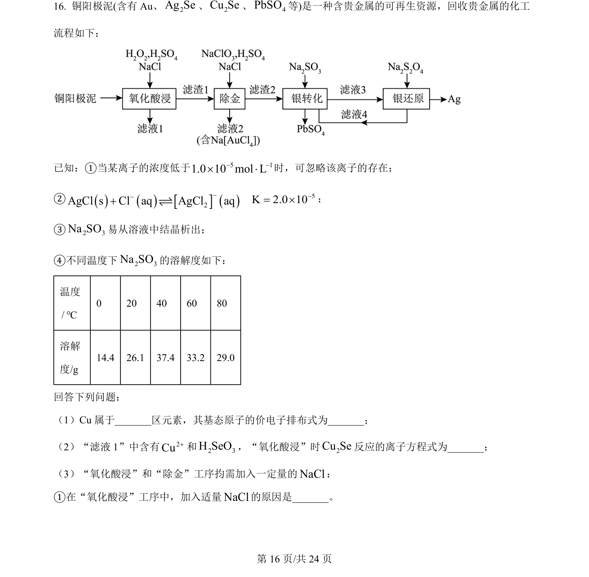
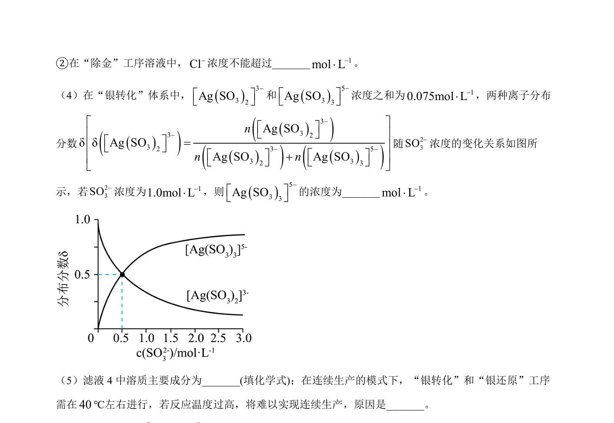
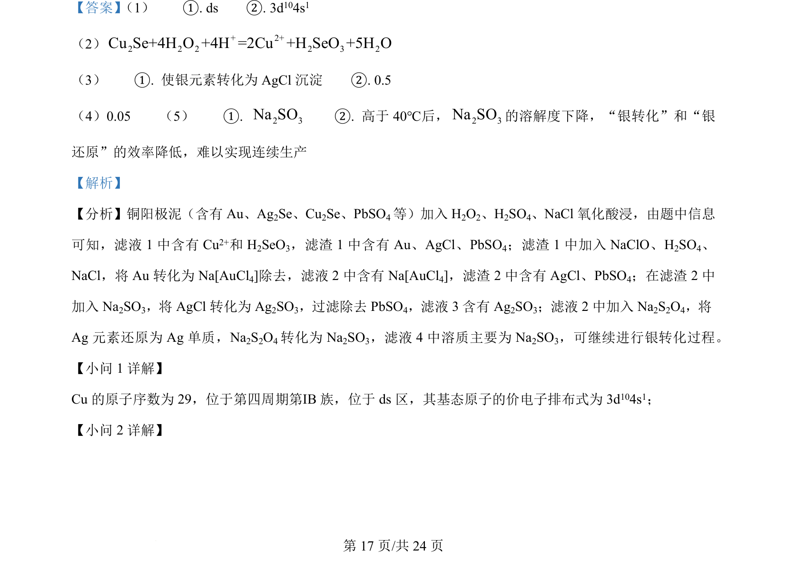
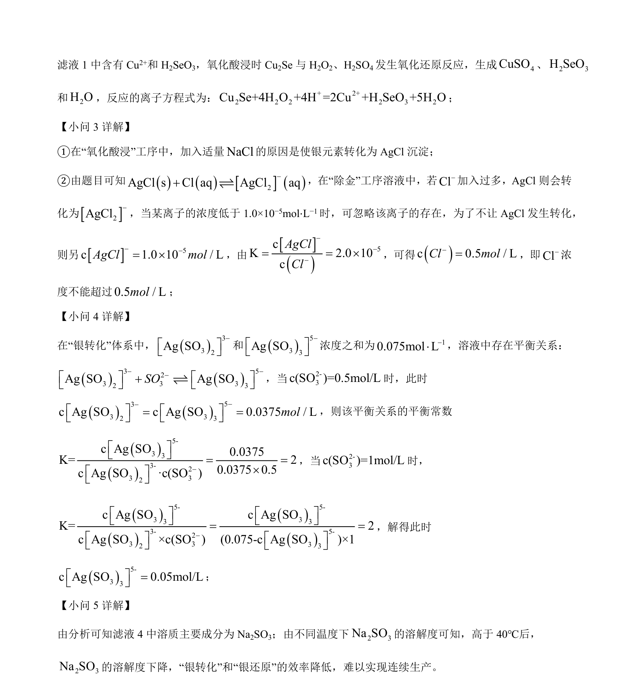

## 题面

## 摘要

铜阳极泥工艺中Cu的原子结构、价电子排布及氧化酸浸反应方程式

## 关联考点

- [[原子结构与元素周期表]]
- [[162-氧化还原反应|氧化还原反应]]
- [[679-工艺流程|化学工艺流程]]

## 答案与解析

> 📄 原 PDF 第 16 页：`素材/真题/湖南/2008-2024·（湖南）化学高考真题/2024年高考化学试卷（湖南）（解析卷）.pdf`
