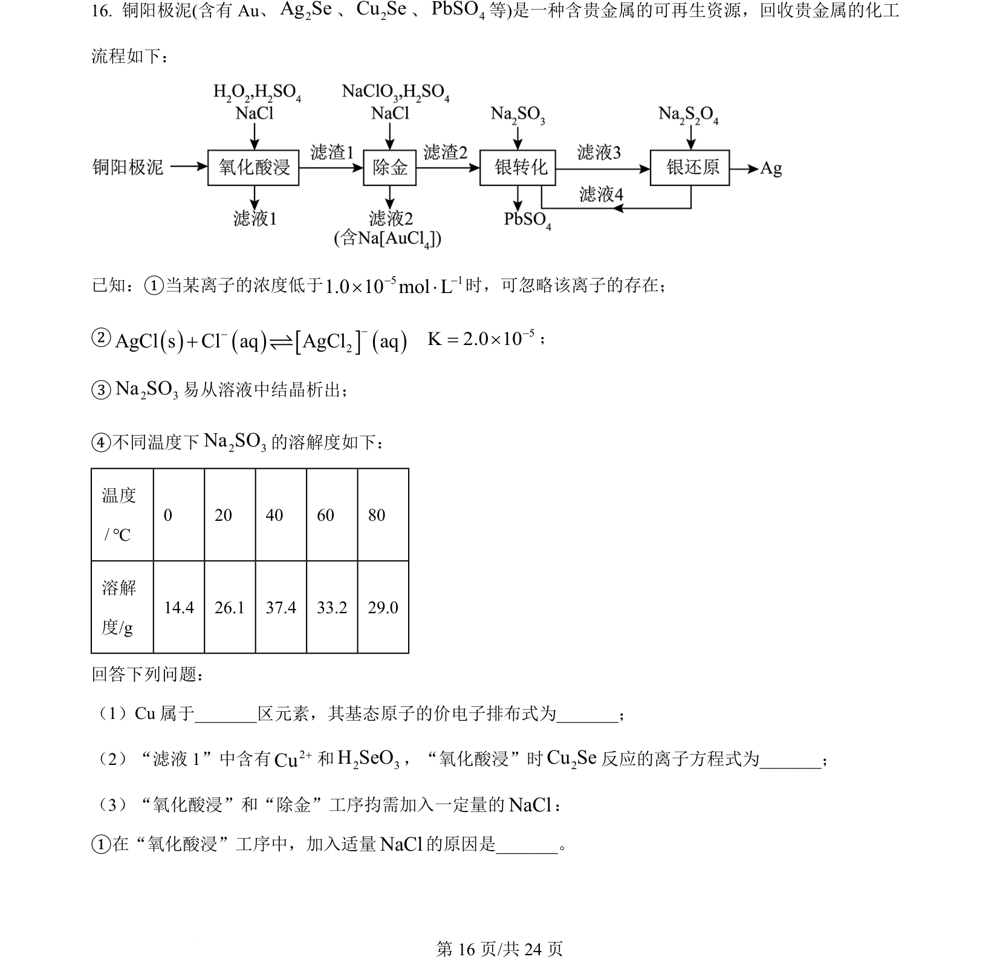
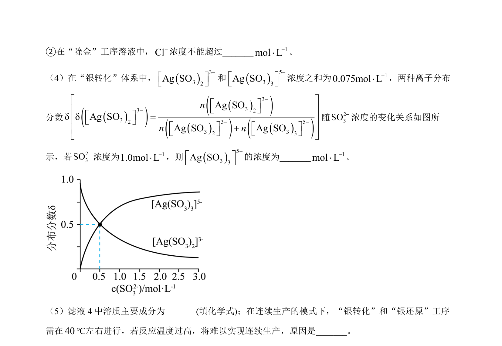
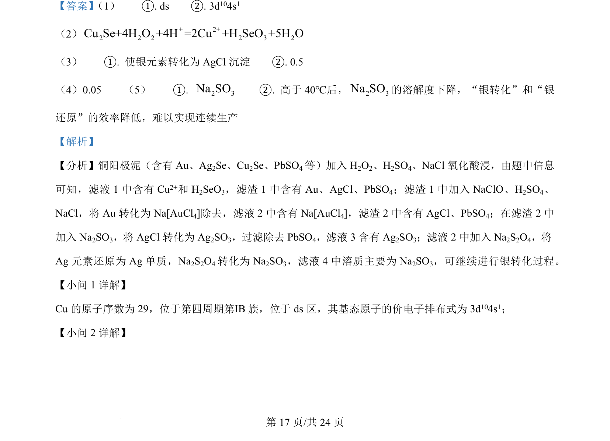
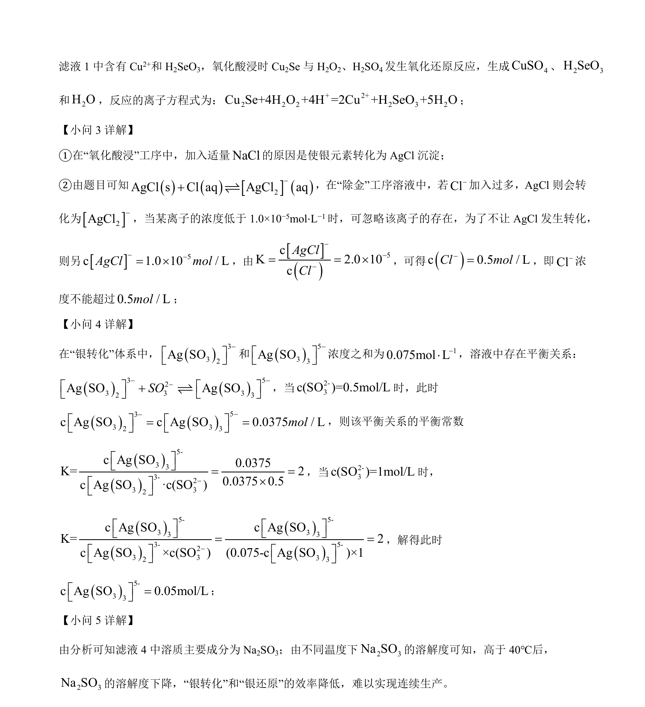

## 题面

## 摘要

铜阳极泥工艺中Cu的原子结构、价电子排布及氧化酸浸反应方程式

## 关联考点

- [[原子结构与元素周期表]]
- [[162-氧化还原反应|氧化还原反应]]
- [[679-工艺流程|化学工艺流程]]

## 答案与解析

> 📄 原 PDF 第 16 页：`素材/真题/湖南/2008-2024·（湖南）化学高考真题/2024年高考化学试卷（湖南）（解析卷）.pdf`

<!-- 题干文本-start -->
## 题干文本
16. 铜阳极泥(含有 Au、2Ag Se、2Cu Se、 4PbSO等)是一种含贵金属的可再生资源，回收贵金属的化工
流程如下：
已知：①当某离子的浓度低于 5 11.0 10 mol L- -´ ×时，可忽略该离子的存在；
②()()2AgCl s Cl aq AgCl aq--+ƒ  5K 2.0 10-= ´；
③2 3Na SO易从溶液中结晶析出；
④不同温度下2 3Na SO的溶解度如下：
温度
/℃
0 20 40 60 80
溶解
度/g
14.4 26.1 37.4 33.2 29.0
回答下列问题：
（1）Cu属于_______区元素，其基态原子的价电子排布式为_______；
（2）“滤液 1”中含有2Cu+和2 3H SeO，“氧化酸浸”时2Cu Se反应的离子方程式为_______；
（3）“氧化酸浸”和“除金”工序抣需加入一定量的NaCl：
①在“氧化酸浸”工序中，加入适量NaCl的原因是_______。
<!-- 题干文本-end -->

<!-- 解析文本-start -->
## 解析文本

<!-- 解析文本-end -->
