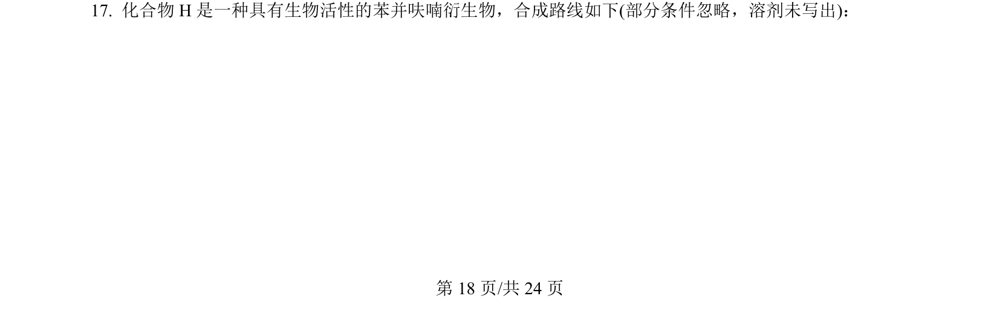
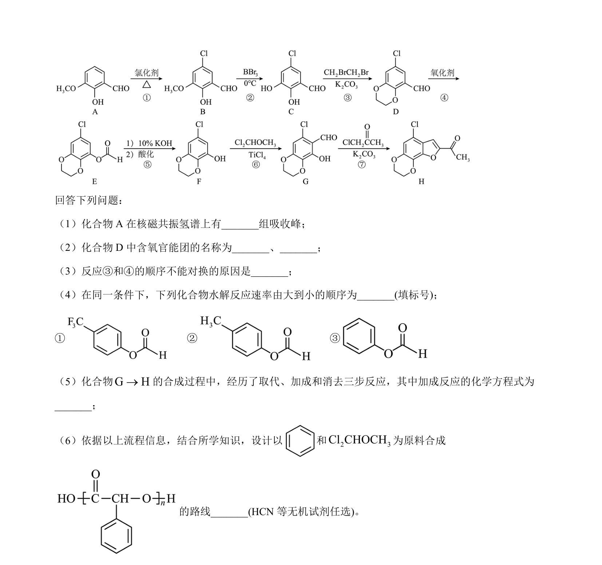
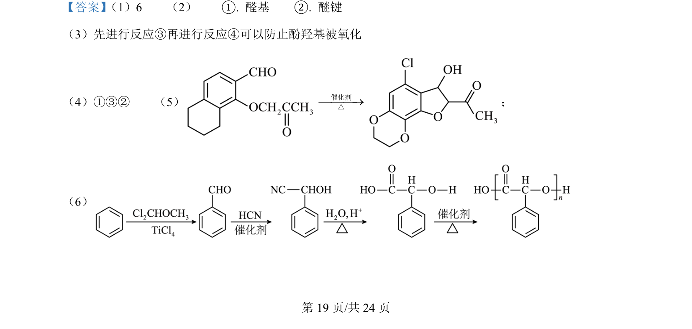
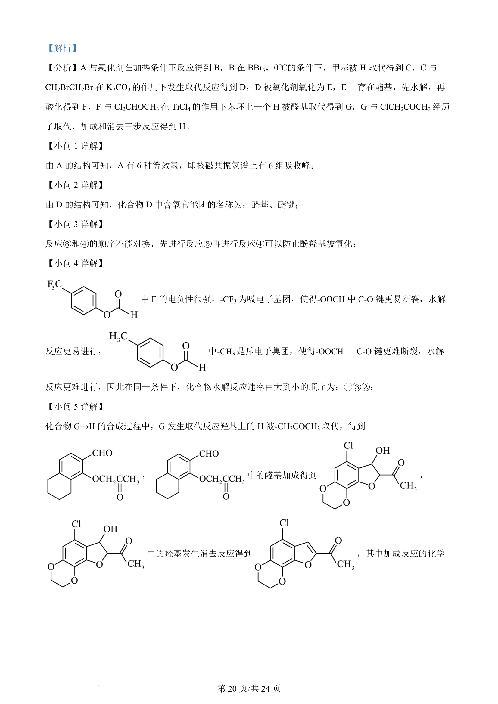
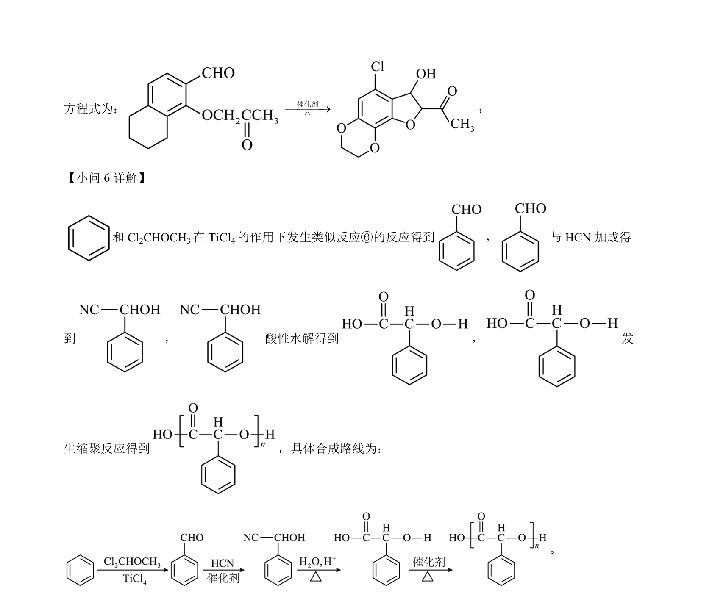

## 题面

## 摘要

考查有机物合成路线分析，涉及结构推断、官能团识别、反应顺序解释及合成设计。

## 关联考点

- [[271-化学合成|有机合成]]
- [[448-官能团|官能团]]
- [[723-核磁共振氢谱|核磁共振氢谱]]
- [[644-反应机理|反应机理]]

## 答案与解析

> 📄 原 PDF 第 18 页：`素材/真题/湖南/2008-2024·（湖南）化学高考真题/2024年高考化学试卷（湖南）（解析卷）.pdf`
