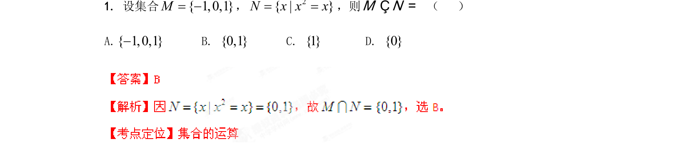

## 题面

## 摘要

考查集合的表示法与交集运算，需先解方程确定集合 N 再求交集。

## 关联考点

- [[1140-集合的表示法|集合的表示法]]
- [[1107-解一元二次方程|解一元二次方程]]
- [[646-交集运算|交集运算]]

## 答案与解析

> 📄 原 PDF 第 1 页：`素材/真题/湖南/2008-2024·（湖南）数学高考真题/2012年高考数学试卷（文）（湖南）（解析卷）.pdf`
