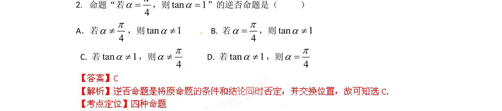

## 题面

## 摘要

该题考查对命题逆否关系的理解，要求将原命题“若p则q”改写为“若非q则非p”的形式。

## 关联考点

- [[逆否命题]]
- [[四种命题]]
- [[1130-逻辑联结词|逻辑联结词]]

## 答案与解析

> 📄 原 PDF 第 1 页：`素材/真题/湖南/2008-2024·（湖南）数学高考真题/2012年高考数学试卷（理）（湖南）（解析卷）.pdf`
