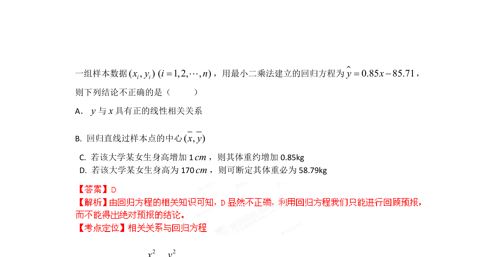

## 题面

## 摘要

女生体重与身高的线性回归关系分析，涉及数据拟合与预测

## 关联考点

- [[359-统计案例|线性回归]]
- [[相关关系]]
- [[491-最小二乘法|最小二乘法]]

## 答案与解析

> 📄 原 PDF 第 1 页：`素材/真题/湖南/2008-2024·（湖南）数学高考真题/2012年高考数学试卷（理）（湖南）（解析卷）.pdf`

<!-- 题干文本-start -->
## 题干文本
4. 设某大学的女生体重y（单位：kg）与身高x（单位：cm）具有线性相关关系，根据
<!-- 题干文本-end -->

<!-- 解析文本-start -->
## 解析文本

<!-- 解析文本-end -->
