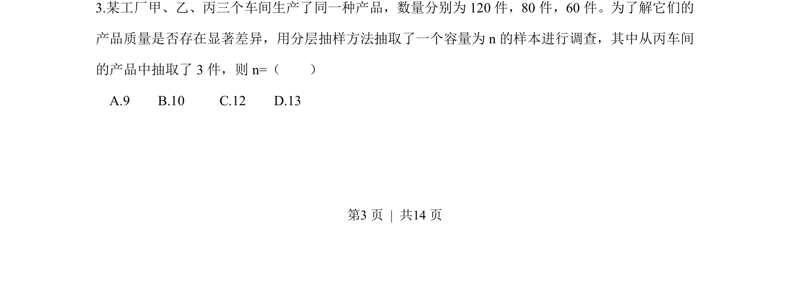

## 题面

## 摘要

分层抽样中已知各层数量及丙车间抽取件数，求样本容量

## 关联考点

- [[319-分层抽样|分层抽样]]
- [[比例分配]]

## 答案与解析

> 📄 原 PDF 第 3 页：`素材/真题/湖南/2008-2024·（湖南）数学高考真题/2013年高考数学试卷（文）（湖南）（解析卷）.pdf`

<!-- 题干文本-start -->
## 题干文本
3.某工厂甲、乙、丙三个车间生产了同一种产品，数量分别为120件，80件，60件。为了解它们的
产品质量是否存在显著差异，用分层抽样方法抽取了一个容量为n的样本进行调查，其中从丙车间
的产品中抽取了3件，则n=（    ）
A.9    B.10     C.12    D.13
<!-- 题干文本-end -->

<!-- 解析文本-start -->
## 解析文本

<!-- 解析文本-end -->
