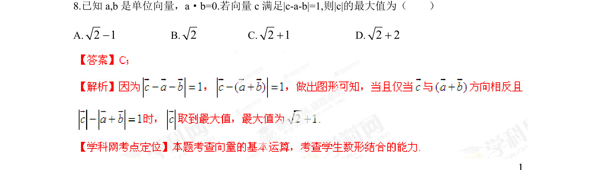

## 题面

## 摘要

向量模的几何意义与最值问题。

## 关联考点

- [[718-单位向量|单位向量]]
- [[752-向量模长|向量的模]]
- [[757-向量运算|向量运算]]
- [[1405-几何意义|几何意义]]

## 答案与解析

> 📄 原 PDF 第 5 页：`素材/真题/湖南/2008-2024·（湖南）数学高考真题/2013年高考数学试卷（文）（湖南）（解析卷）.pdf`
