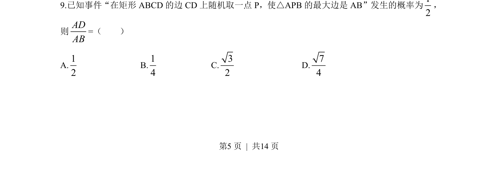
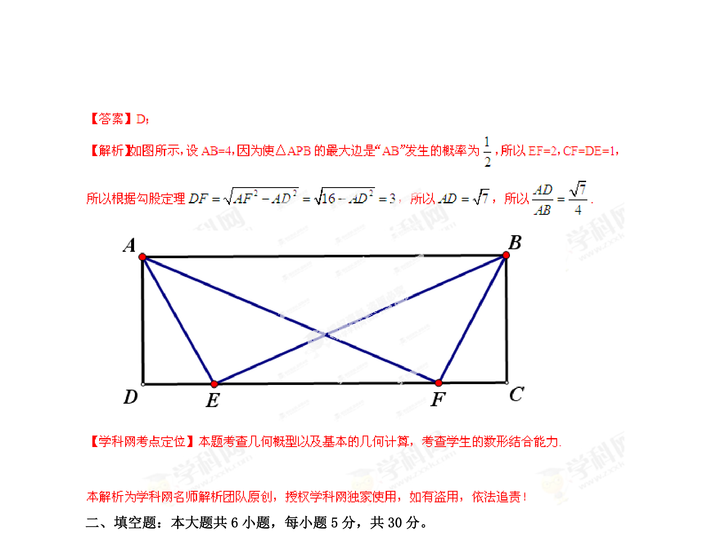

## 题面

## 摘要

在矩形边上随机取点，利用几何概型求解使三角形最大边为某边的概率，推出边长比。

## 关联考点

- [[667-几何概型|几何概型]]
- [[518-直角三角形|直角三角形]]
- [[083-不等式|不等式]]

## 答案与解析

> 📄 原 PDF 第 5 页：`素材/真题/湖南/2008-2024·（湖南）数学高考真题/2013年高考数学试卷（文）（湖南）（解析卷）.pdf`
