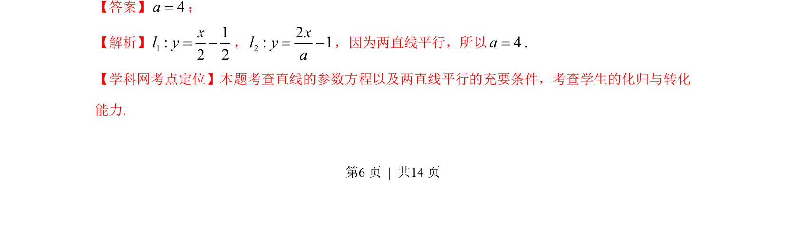

## 题面

## 摘要

该题考查根据两直线参数方程平行条件求解参数值。

## 关联考点

- [[直线的参数方程]]
- [[两直线平行的充要条件]]

## 答案与解析

> 📄 原 PDF 第 6 页：`素材/真题/湖南/2008-2024·（湖南）数学高考真题/2013年高考数学试卷（文）（湖南）（解析卷）.pdf`

<!-- 题干文本-start -->
## 题干文本
11.在平面直角坐标系xOy中，若直线12 1,:x sly s= +ìí=î
（s为参数）和直线2,:2 1x atly t=ìí= -î
（t为参数）
平行，则常数a的值为________
<!-- 题干文本-end -->

<!-- 解析文本-start -->
## 解析文本
【答案】4a=；
【解析】11:2 2xl y= -，22: 1xl ya= -，因为两直线平行，所以4a=.
【学科网考点定位】本题考查直线的参数方程以及两直线平行的充要条件，考查学生的化归与转化
能力.
<!-- 解析文本-end -->
