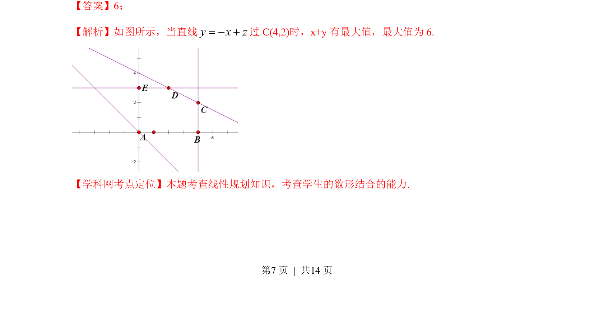

## 题面

## 摘要

本题考查线性规划中目标函数最值问题，通过平移直线求最优解。

## 关联考点

- [[1074-简单线性规划|线性规划]]
- [[897-数形结合|数形结合]]
- [[913-最值问题|最值问题]]

## 答案与解析

> 📄 原 PDF 第 7 页：`素材/真题/湖南/2008-2024·（湖南）数学高考真题/2013年高考数学试卷（文）（湖南）（解析卷）.pdf`
