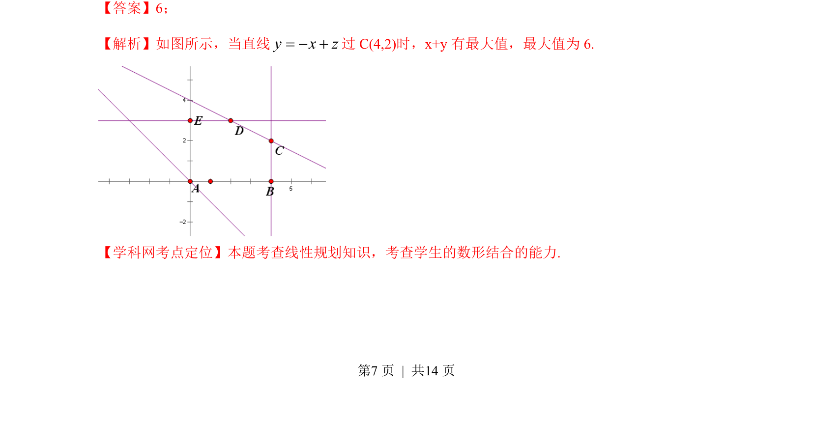

## 题面

## 摘要

本题考查线性规划中目标函数最值问题，通过平移直线求最优解。

## 关联考点

- [[1074-简单线性规划|线性规划]]
- [[897-数形结合|数形结合]]
- [[913-最值问题|最值问题]]

## 答案与解析

> 📄 原 PDF 第 7 页：`素材/真题/湖南/2008-2024·（湖南）数学高考真题/2013年高考数学试卷（文）（湖南）（解析卷）.pdf`

<!-- 题干文本-start -->
## 题干文本
13.若变量x,y满足约束条件
2 8,0 4,0 3,x yxy+ £ìï£ £íï£ £î
则x+y的最大值为________
<!-- 题干文本-end -->

<!-- 解析文本-start -->
## 解析文本
【答案】6；
【解析】如图所示，当直线y x z= - +过C(4,2)时，x+y有最大值，最大值为6.
【学科网考点定位】本题考查线性规划知识，考查学生的数形结合的能力.
<!-- 解析文本-end -->
