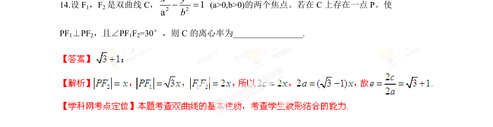

## 题面

## 摘要

双曲线上点P与两焦点构成直角三角形且一角30°，求离心率

## 关联考点

- [[367-双曲线几何性质|双曲线的几何性质]]
- [[391-椭圆离心率|离心率]]
- [[571-焦点三角形|焦点三角形]]

## 答案与解析

> 📄 原 PDF 第 8 页：`素材/真题/湖南/2008-2024·（湖南）数学高考真题/2013年高考数学试卷（文）（湖南）（解析卷）.pdf`

<!-- 题干文本-start -->
## 题干文本
14.设F 1，F2是双曲线C，
2 22 21ax yb- = (a>0,b>0)的两个焦点。若在C上存在一点P。使
PF1⊥PF2，且∠PF1F2=30°，则C的离心率为________________.
<!-- 题干文本-end -->

<!-- 解析文本-start -->
## 解析文本

<!-- 解析文本-end -->
