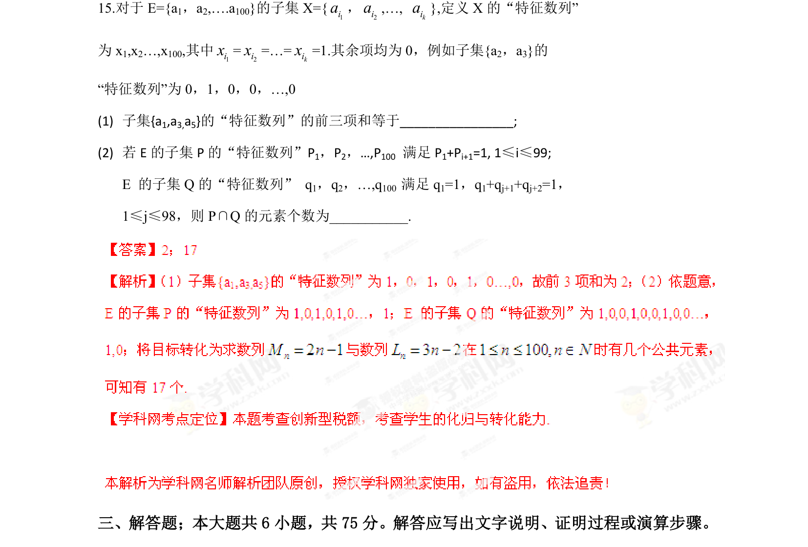

## 题面

## 摘要

子集特征数列定义的应用，求特定子集的特征数列前项和以及由方程约束确定两子集的交集元素个数。

## 关联考点

- [[042-集合|集合]]
- [[特征数列]]
- [[1382-数列递推|数列递推]]
- [[1222-交集|交集]]

## 答案与解析

> 📄 原 PDF 第 8 页：`素材/真题/湖南/2008-2024·（湖南）数学高考真题/2013年高考数学试卷（文）（湖南）（解析卷）.pdf`
