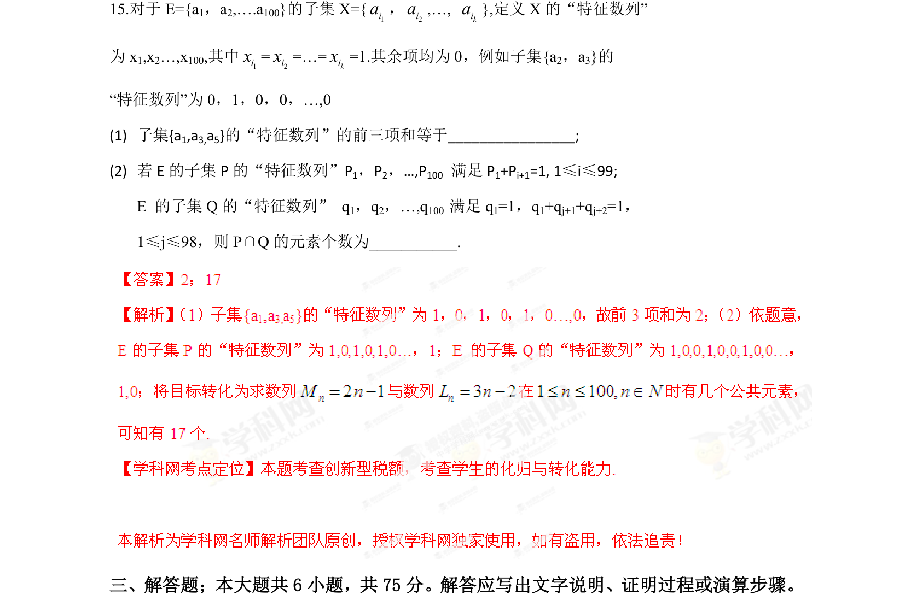

## 题面

## 摘要

子集特征数列定义的应用，求特定子集的特征数列前项和以及由方程约束确定两子集的交集元素个数。

## 关联考点

- [[042-集合|集合]]
- [[特征数列]]
- [[1382-数列递推|数列递推]]
- [[1222-交集|交集]]

## 答案与解析

> 📄 原 PDF 第 8 页：`素材/真题/湖南/2008-2024·（湖南）数学高考真题/2013年高考数学试卷（文）（湖南）（解析卷）.pdf`

<!-- 题干文本-start -->
## 题干文本
15.对于E={a 1，a2,….a100}的子集X={1ia，2ia,…, kia},定义X的“特征数列”
为x 1,x2…,x100,其中1ix=2ix=…=kix=1.其余项均为0，例如子集{a 2，a3}的
“特征数列”为0，1，0，0，…,0 
(1)子集{a 1,a3,a5}的“特征数列”的前三项和等于________________;
(2)若E的子集P的“特征数列”P 1，P2，…,P100 满足P 1+Pi+1=1, 1≤i≤99;
E 的子集Q的“特征数列” q 1，q2，…,q100 满足q 1=1，q1+qj+1+qj+2=1，
1≤j≤98，则P∩Q的元素个数为___________.
三、解答题；本大题共6小题，共75分。解答应写出文字说明、证明过程或演算步骤。
<!-- 题干文本-end -->

<!-- 解析文本-start -->
## 解析文本

<!-- 解析文本-end -->
