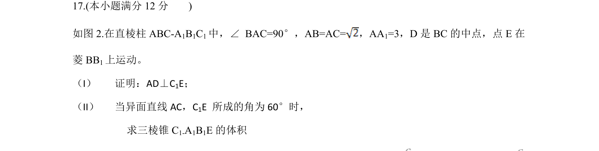
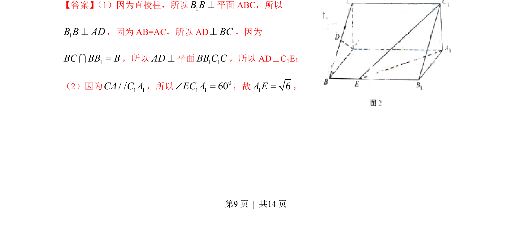
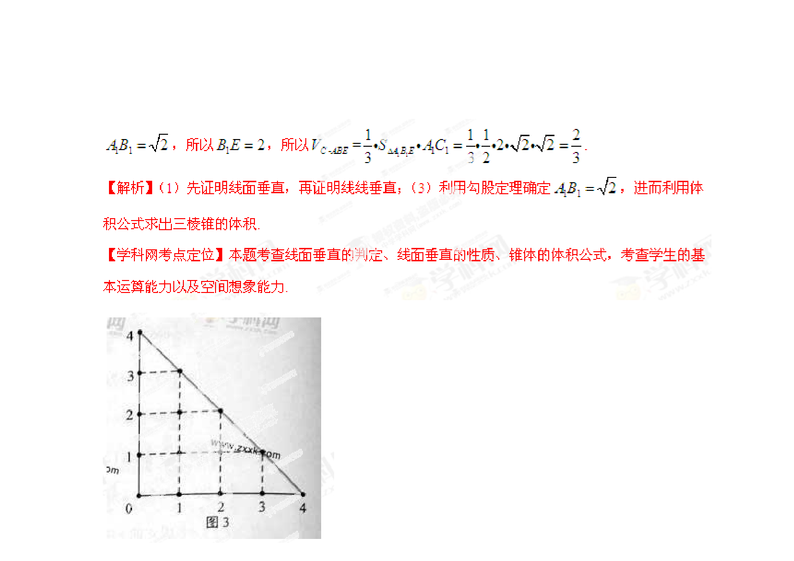

## 题面

## 摘要

考查利用导数研究函数单调性并证明不等式。

## 关联考点

- [[705-利用导数研究函数的单调性|导数与单调性]]
- [[674-函数不等式证明|函数不等式证明]]

## 答案与解析

> 📄 原 PDF 第 9 页：`素材/真题/湖南/2008-2024·（湖南）数学高考真题/2013年高考数学试卷（文）（湖南）（解析卷）.pdf`

<!-- 题干文本-start -->
## 题干文本
17.(本小题满分12分)
如图2.在直棱柱ABC-A 1B1C1中，∠ BAC=90°，AB=AC=，AA 1=3，D是BC的中点，点E在
菱BB 1上运动。
（I） 证明：AD⊥C 1E；
（II） 当异面直线AC，C 1E 所成的角为60°时，
求三棱锥C 1-A1B1E的体积
<!-- 题干文本-end -->

<!-- 解析文本-start -->
## 解析文本
【答案】 （1）因为直棱柱，所以1B B^平面ABC，所以
1B B AD^，因为AB=AC，所以ADBC^，因为
1BC BB B=I，所以AD^平面1 1BB C C，所以AD⊥C 1E；
（2）因为 1 1/ /CA C A，所以 01 160EC AÐ =，故16A E=，
<!-- 解析文本-end -->
