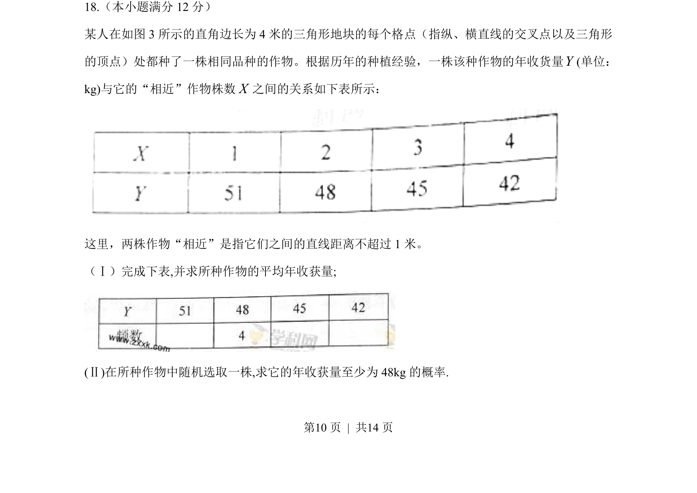
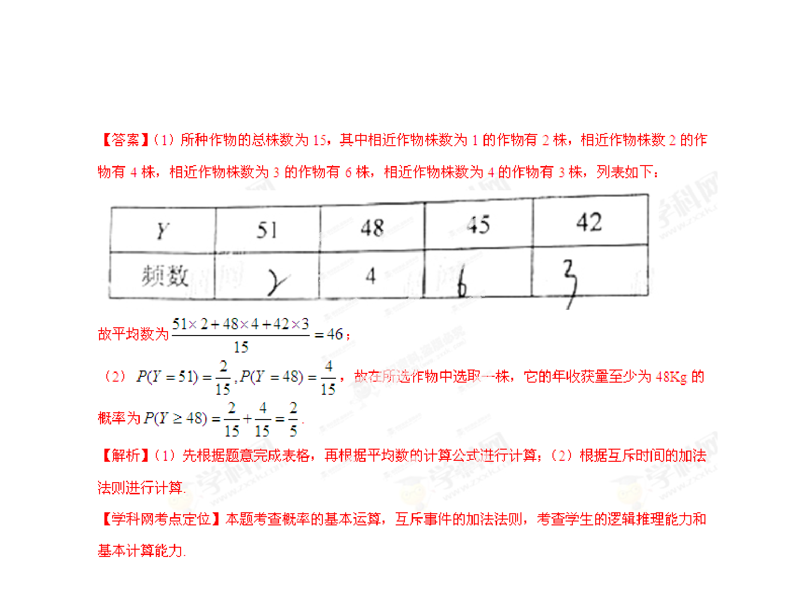

## 题面

## 摘要

在三角形格点地块中，根据作物相近株数与收获量的关系，求平均年收获量及至少48kg的概率。

## 关联考点

- [[320-古典概型|古典概型]]
- [[193-平均数|加权平均数]]
- [[1152-频数分布表|频数分布表]]
- [[格点计数]]

## 答案与解析

> 📄 原 PDF 第 10 页：`素材/真题/湖南/2008-2024·（湖南）数学高考真题/2013年高考数学试卷（文）（湖南）（解析卷）.pdf`
