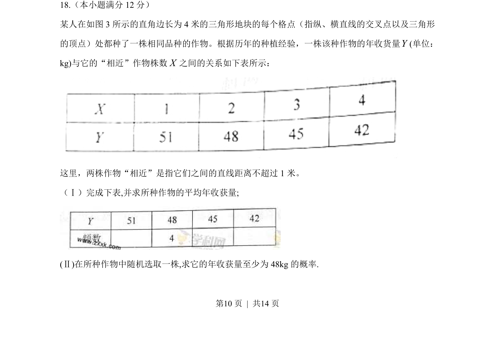
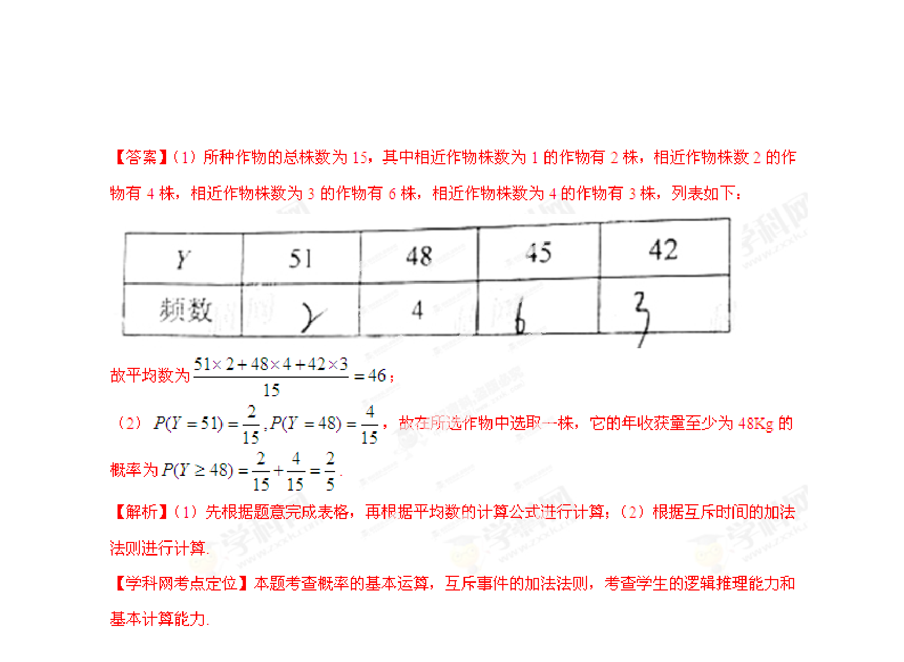

## 题面

## 摘要

在三角形格点地块中，根据作物相近株数与收获量的关系，求平均年收获量及至少48kg的概率。

## 关联考点

- [[320-古典概型|古典概型]]
- [[055-平均数|加权平均数]]
- [[1152-频数分布表|频数分布表]]
- [[格点计数]]

## 答案与解析

> 📄 原 PDF 第 10 页：`素材/真题/湖南/2008-2024·（湖南）数学高考真题/2013年高考数学试卷（文）（湖南）（解析卷）.pdf`

<!-- 题干文本-start -->
## 题干文本
18.（本小题满分12分）
某人在如图3所示的直角边长为4米的三角形地块的每个格点（指纵、横直线的交叉点以及三角形
的顶点）处都种了一株相同品种的作物。根据历年的种植经验，一株该种作物的年收货量Y(单位：
kg)与它的“相近”作物株数X之间的关系如下表所示：
这里，两株作物“相近”是指它们之间的直线距离不超过1米。
（Ⅰ）完成下表,并求所种作物的平均年收获量;
(Ⅱ)在所种作物中随机选取一株,求它的年收获量至少为48kg的概率.
<!-- 题干文本-end -->

<!-- 解析文本-start -->
## 解析文本

<!-- 解析文本-end -->
