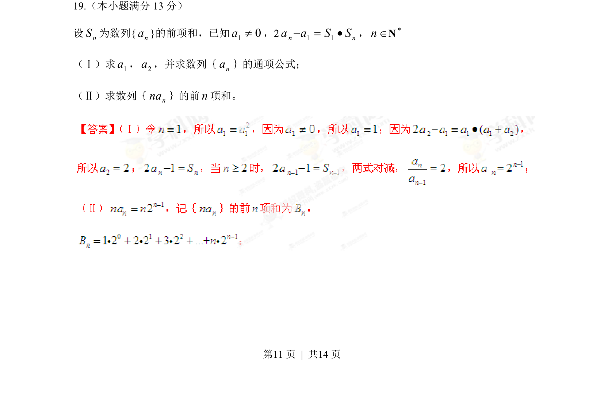
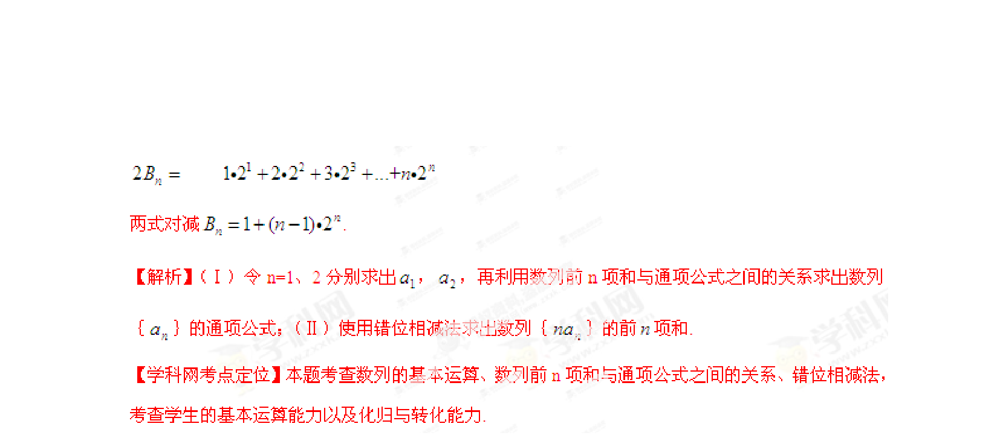

## 题面

## 摘要

已知数列前n项和关系求通项公式，并求数列{n·a_n}的前n项和。

## 关联考点

- [[1309-数列递推求通项|数列递推求通项]]
- [[错位相减法求和]]
- [[数列前n项和]]

## 答案与解析

> 📄 原 PDF 第 11 页：`素材/真题/湖南/2008-2024·（湖南）数学高考真题/2013年高考数学试卷（文）（湖南）（解析卷）.pdf`
