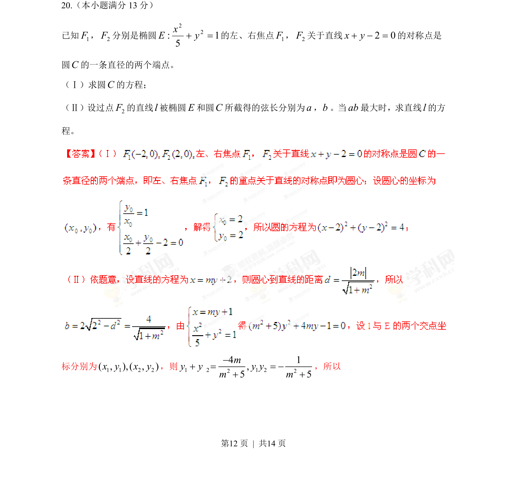
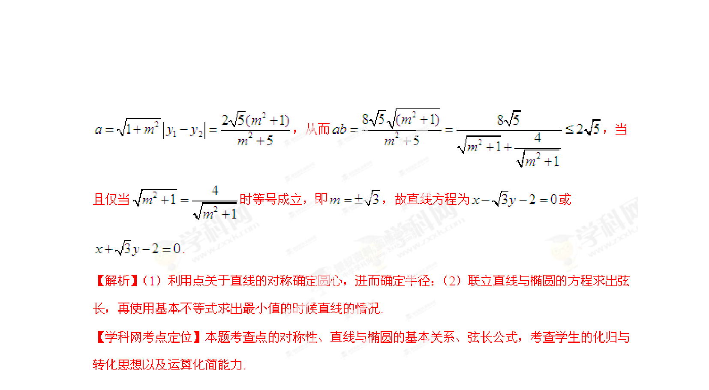

## 题面

## 摘要

已知椭圆焦点关于直线的对称点为圆直径端点，求圆方程及直线与椭圆、圆相交弦长乘积最大时的直线方程

## 关联考点

- [[389-椭圆定义与方程|椭圆]]
- [[220-圆-定义|圆]]
- [[014-对称|对称]]
- [[弦长最值]]

## 答案与解析

> 📄 原 PDF 第 12 页：`素材/真题/湖南/2008-2024·（湖南）数学高考真题/2013年高考数学试卷（文）（湖南）（解析卷）.pdf`
