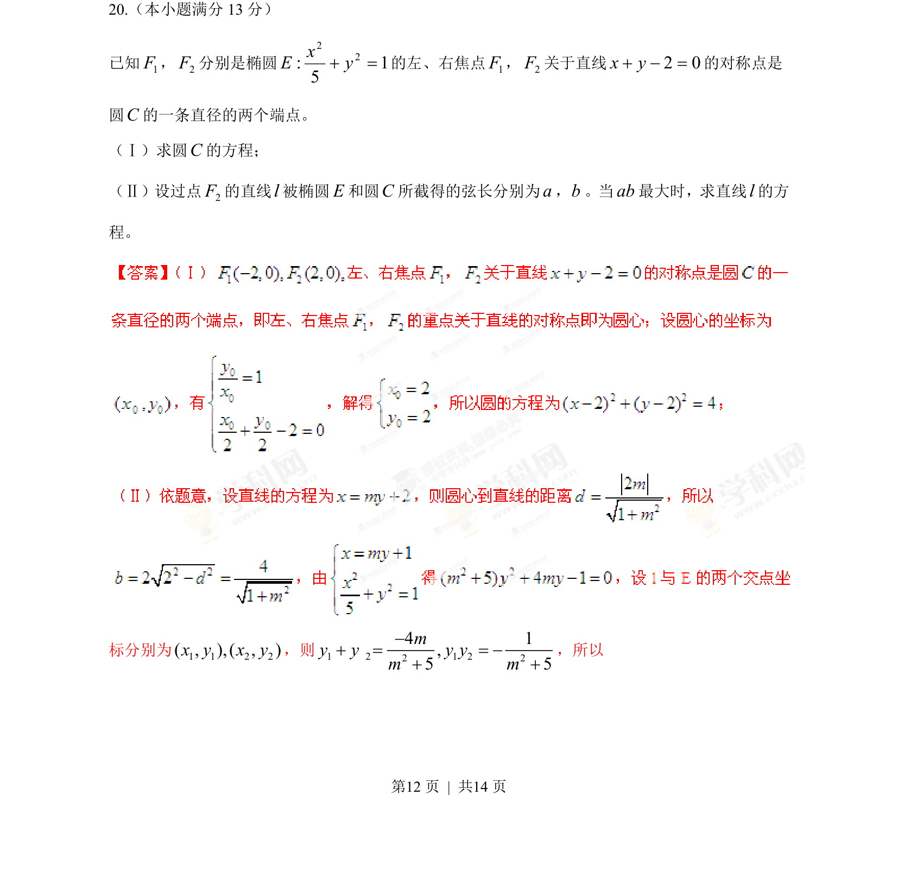
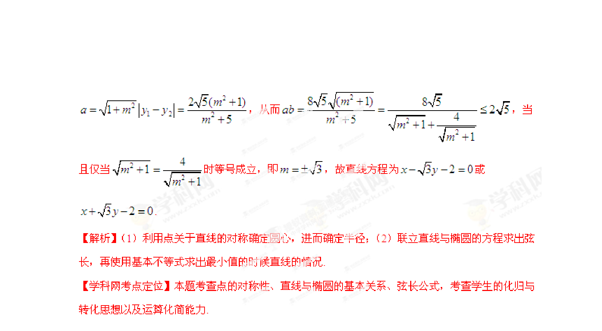

## 题面

## 摘要

已知椭圆焦点关于直线的对称点为圆直径端点，求圆方程及直线与椭圆、圆相交弦长乘积最大时的直线方程

## 关联考点

- [[389-椭圆定义与方程|椭圆]]
- [[220-圆-定义|圆]]
- [[014-对称|对称]]
- [[弦长最值]]

## 答案与解析

> 📄 原 PDF 第 12 页：`素材/真题/湖南/2008-2024·（湖南）数学高考真题/2013年高考数学试卷（文）（湖南）（解析卷）.pdf`

<!-- 题干文本-start -->
## 题干文本
20.（本小题满分13分）
已知1F，2F分别是椭圆 15:22=+yxE的左、右焦点1F，2F关于直线 02=-+yx的对称点是
圆C的一条直径的两个端点。
（Ⅰ）求圆C的方程；
（Ⅱ）设过点2F的直线l被椭圆E和圆C所截得的弦长分别为a，b。 当ab最大时， 求直线l的方
程。
标分别为1 1 2 2( , ),( , )x y x y，则1 2 1 22 24 1,5 5my y y ym m-+ = = -+ +
，所以
<!-- 题干文本-end -->

<!-- 解析文本-start -->
## 解析文本

<!-- 解析文本-end -->
