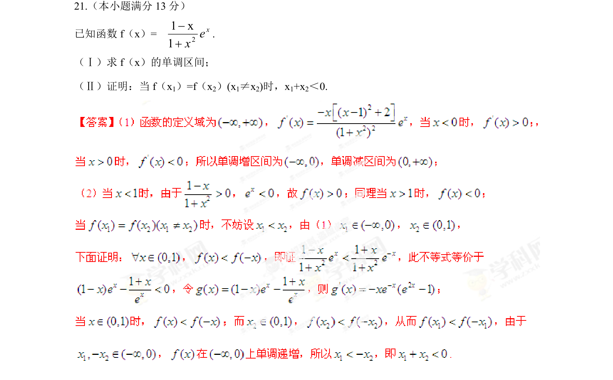
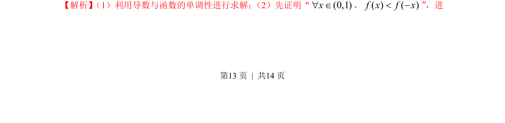
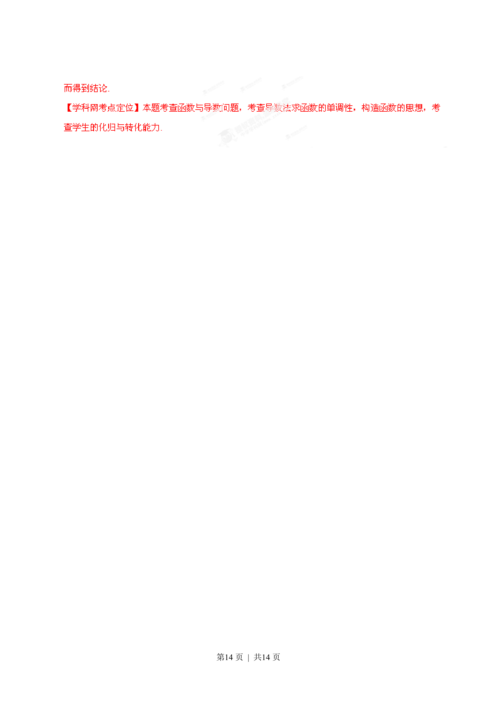

## 题面

## 摘要

利用导数求函数单调区间，并证明与极值点偏移相关的不等式。

## 关联考点

- [[1272-利用导数研究函数单调性|导数求单调区间]]
- [[1313-极值点偏移|极值点偏移]]
- [[1412-构造函数证明不等式|构造函数证明不等式]]

## 答案与解析

> 📄 原 PDF 第 13 页：`素材/真题/湖南/2008-2024·（湖南）数学高考真题/2013年高考数学试卷（文）（湖南）（解析卷）.pdf`
