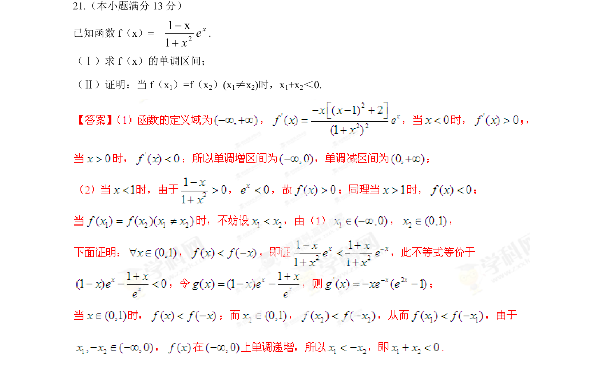
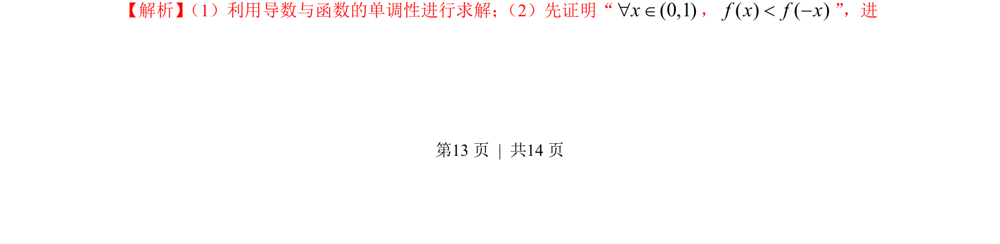
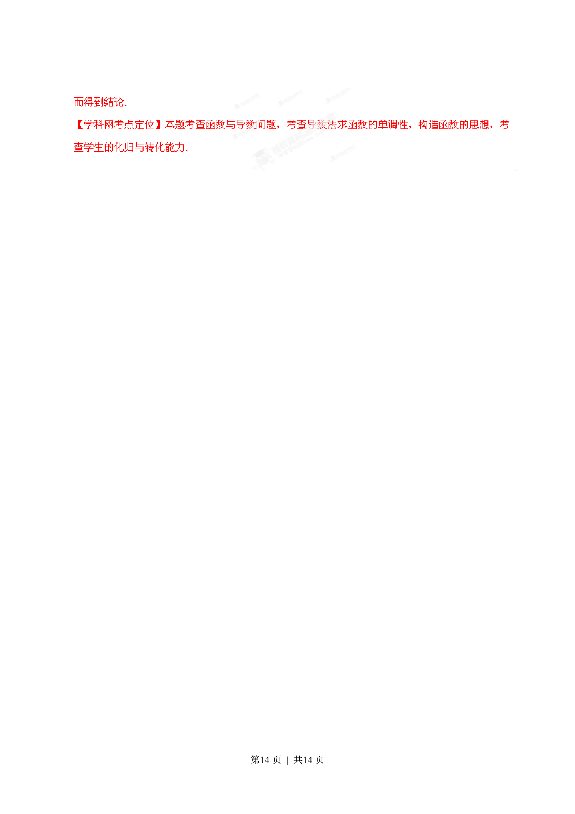

## 题面

## 摘要

利用导数求函数单调区间，并证明与极值点偏移相关的不等式。

## 关联考点

- [[705-利用导数研究函数的单调性|导数求单调区间]]
- [[1313-极值点偏移|极值点偏移]]
- [[1412-构造函数证明不等式|构造函数证明不等式]]

## 答案与解析

> 📄 原 PDF 第 13 页：`素材/真题/湖南/2008-2024·（湖南）数学高考真题/2013年高考数学试卷（文）（湖南）（解析卷）.pdf`

<!-- 题干文本-start -->
## 题干文本
21.（本小题满分13分）
已知函数f（x）= xex21x1+-.
（Ⅰ）求f（x）的单调区间；
（Ⅱ）证明：当f（x 1）=f（x2）(x1≠x2)时，x1+x2＜0.
<!-- 题干文本-end -->

<!-- 解析文本-start -->
## 解析文本
【解析】 （1）利用导数与函数的单调性进行求解； （2）先证明“(0,1)x" ∈，( ) ( )f x f x< -”，进
<!-- 解析文本-end -->
