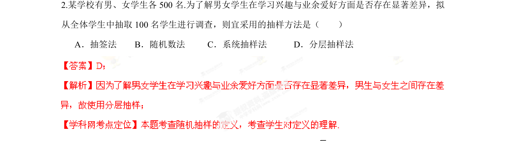

## 题面

## 摘要

考查根据性别差异选择合适抽样方法，体现分层抽样思想。

## 关联考点

- [[319-分层抽样|分层抽样]]
- [[881-抽样方法|抽样方法]]

## 答案与解析

> 📄 原 PDF 第 3 页：`素材/真题/湖南/2008-2024·（湖南）数学高考真题/2013年高考数学试卷（理）（湖南）（解析卷）.pdf`

<!-- 题干文本-start -->
## 题干文本
2.某学校有男、女学生各500名.为了解男女学生在学习兴趣与业余爱好方面是否存在显著差异，拟
从全体学生中抽取100名学生进行调查，则宜采用的抽样方法是（    ）
A．抽签法    B．随机数法     C．系统抽样法      D．分层抽样法
<!-- 题干文本-end -->

<!-- 解析文本-start -->
## 解析文本

<!-- 解析文本-end -->
