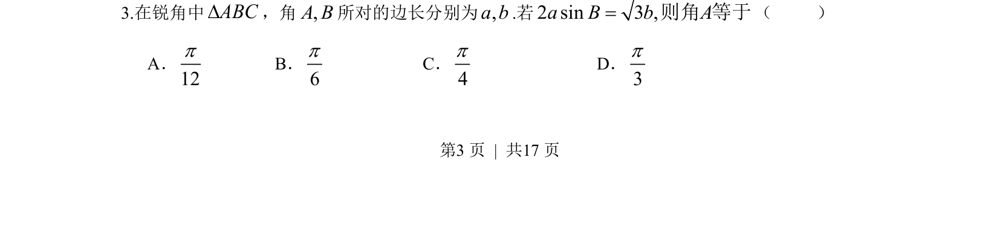
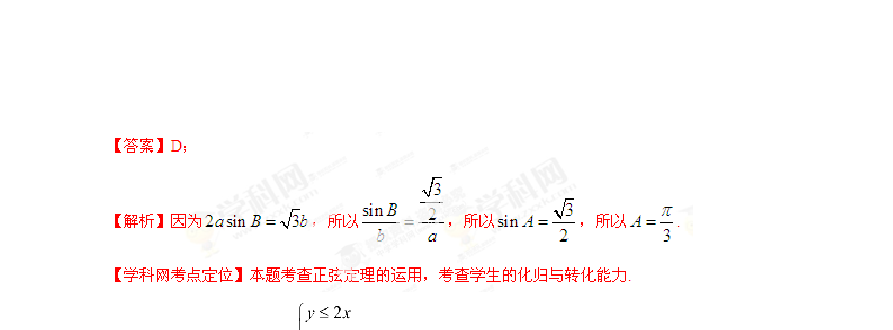

## 题面

## 摘要

利用正弦定理将边角关系转化为角的正弦值，结合锐角三角形条件求角。

## 关联考点

- [[126-定理|正弦定理]]
- [[589-解三角形|解三角形]]
- [[610-三角函数求值|三角函数求值]]

## 答案与解析

> 📄 原 PDF 第 3 页：`素材/真题/湖南/2008-2024·（湖南）数学高考真题/2013年高考数学试卷（理）（湖南）（解析卷）.pdf`
