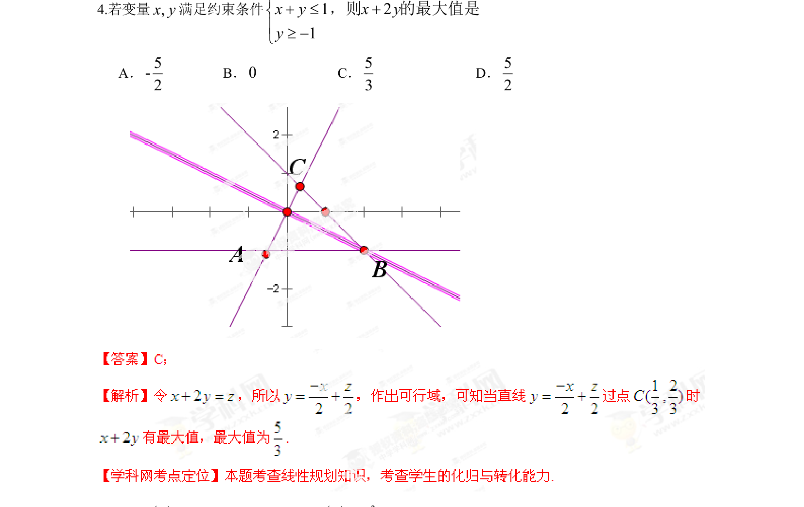

## 题面

## 摘要

线性规划中根据约束条件求目标函数的最大值

## 关联考点

- [[1074-简单线性规划|线性规划]]
- [[约束条件]]
- [[999-目标函数|目标函数]]
- [[286-函数的最值|最值]]

## 答案与解析

> 📄 原 PDF 第 4 页：`素材/真题/湖南/2008-2024·（湖南）数学高考真题/2013年高考数学试卷（理）（湖南）（解析卷）.pdf`
