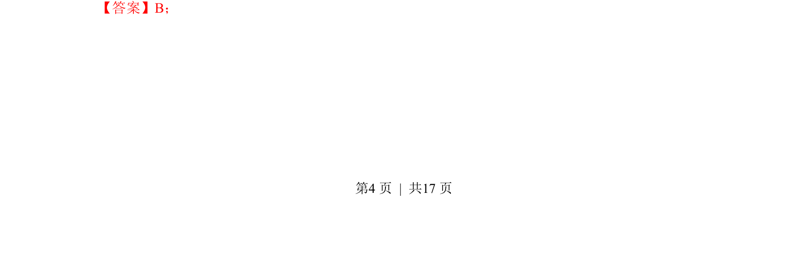
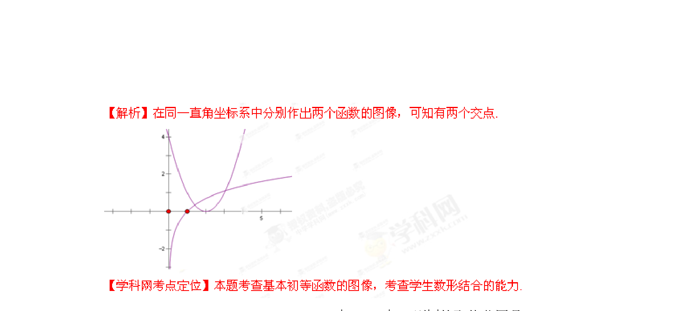

## 题面

## 摘要

考查利用导数或图像判断对数函数与二次函数图像的交点个数。

## 关联考点

- [[函数交点]]
- [[298-对数函数|对数函数]]
- [[212-二次函数定义|二次函数]]
- [[897-数形结合|数形结合]]

## 答案与解析

> 📄 原 PDF 第 4 页：`素材/真题/湖南/2008-2024·（湖南）数学高考真题/2013年高考数学试卷（理）（湖南）（解析卷）.pdf`
