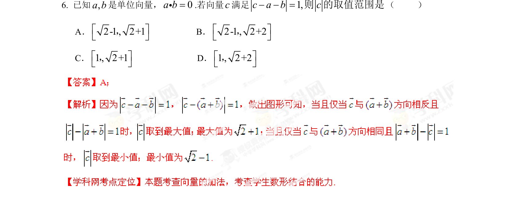

## 题面

## 摘要

向量模长与几何意义结合，求满足条件的向量终点到原点距离范围

## 关联考点

- [[752-向量模长|向量模长]]
- [[328-向量的数量积|向量的数量积]]
- [[1405-几何意义|几何意义]]
- [[897-数形结合|数形结合]]

## 答案与解析

> 📄 原 PDF 第 5 页：`素材/真题/湖南/2008-2024·（湖南）数学高考真题/2013年高考数学试卷（理）（湖南）（解析卷）.pdf`
