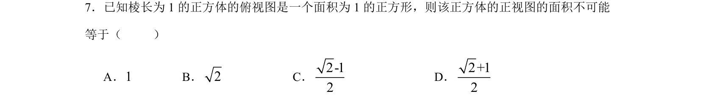

## 题面

## 摘要

考查正方体正视图面积的计算与判断，需根据三视图还原几何体特征。

## 关联考点

- [[235-三视图|三视图]]
- [[019-正方体|正方体]]
- [[1053-空间想象|空间想象]]

## 答案与解析

> 📄 原 PDF 第 5 页：`素材/真题/湖南/2008-2024·（湖南）数学高考真题/2013年高考数学试卷（理）（湖南）（解析卷）.pdf`
