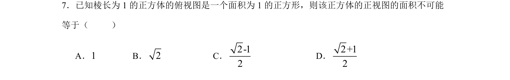

## 题面

## 摘要

考查正方体正视图面积的计算与判断，需根据三视图还原几何体特征。

## 关联考点

- [[235-三视图|三视图]]
- [[019-正方体|正方体]]
- [[1053-空间想象|空间想象]]

## 答案与解析

> 📄 原 PDF 第 5 页：`素材/真题/湖南/2008-2024·（湖南）数学高考真题/2013年高考数学试卷（理）（湖南）（解析卷）.pdf`

<!-- 题干文本-start -->
## 题干文本
7．已知棱长为1的正方体的俯视图是一个面积为1的正方形，则该正方体的正视图的面积不可能
等于（     ）
A．1        B．2           C．2-12
              D．2+12
<!-- 题干文本-end -->

<!-- 解析文本-start -->
## 解析文本
【答案】C；
【解析】正方体的正视图面积应当介意1与2之间，故C不正确.
【学科网考点定位】本题考查三视图，考查学生的空间想象能力.
<!-- 解析文本-end -->
